btb btc

리전: LB, Object Story

존: 서버 CDB

리전 무관한 상품인지 (통합 상품인지) DNS Paas ACG

# Compute 상품

HPC 대규모 연산이 빠르게 이루어져야하는 상품 (컴퓨팅 파워가 높음)

GPU 머신러닝을 위한 상품

1vCPU를 지난 마이크로서버도 제공 계정당 한대만 사용할 수 있다.

네트워크(outbound)에 대해서만 요금이 발생하게된다. 

서버를 만들게되면50G의 하드디스크를 제공하는데 이 부분을 기본 스토리지로 표시가된다. 

기본스토리지에 대해서는 스토리지의 공간을 늘리거나 변경하진 못한다.

스토리지에 대해서는 서버를 종료하더라도 요금이 부과된다. 

특수 서버같은경우는 서버를 종료해도 요금이 부과된다.

SSD HDD 디스크 타입 제공

빠른 퍼포먼스를 원하면 SSD를 이용

아니면 HDD를 이용하면된다.

최대 IOPS 보장

디스크 용량이 가변적

### 서버 타입

Micro: 무료 체험용 서버

​	추천용도: 서비스 체험용

​	서버 스펙: CentOS, Ubuntu/ 1vCPU, 1G램 50G HDD

Compact: 저사양서버

​	추천용도: 개발 테스트 서버, 개인용 홈페이지 운영, 소규모 웹사이트 운영

​	서버 스펙: CentOS, Ubuntu, WIndows/ 2~16vCPU, 4~32GB 램

Standard: 범용서버 균형잡힌 서버 사양 높은 가용성, 서비스 안정성

​	추천용도: 중/대규모모바일 및 웹 서비스 운영, 게임/미디어/금융서비스 운영

​	서버 스펙: CentOS, Ubuntu, WIndows/ 2~16vCPU, 4~32GB 램

High Memory: 64GB 이상의 고 메모리 서버

​	추천용도: 고성능 데이터베이스 서버, 대규모 게임 서비스

​	서버 스펙: CentOS, Ubuntu, Windows/ 8~32vCPU, 64~256G램

CPU Intensive: 고성능 CPU를 장착해 많은 연산이 필요한 업무에 최적화된 서버.

​	추천용도: 머신/딥러닝용 처리서버, 고성능 웹서버, HPC/배치 처리, 비디오 인코딩

​	서버 스펙: CentOS, Ubuntu, Windows/ 2~32VCPU, 4~64램

VDS: 

​	서버 스펙: CentOS, Ubuntu, Windows/ 20~32vCPU, 80~232G램, 1~2TB HDD(로컬 디스크로 제공)

마이크로서버는 서버 스펙이 고정이라 변경이 불가능하고

Compact, Standard서버는 즉시 서버 스펙을 업 할 수 있다. 하지만 High Memory로 업그레이드 할 수 는 없다. 

VDS와 CPU Intensive는 스펙업이 불가능하다고 보면된다.

Bare Metal Server는 VM이나 서버 가상화를 쓰는게 아니라 클라우드에서 물리서버를 제공하는 형태.

높은 서버스펙을 요구하거나 라이센스 제약사항때문에 Bare Metal을 쓰게된다.

적합한 RAID 구성 방식을 선택할 수 있다. (RAID 1+0/ RAID5)

36코어에 mssql스텐다드를 설치해봤자 20코어 밖에 사용하지 못한다. 

그래서 20코어 스펙을 최적화 스펙으로 베어메탈을 제공한다. 

36코어 20코어 8코어 4코어 베어메탈 서버가 있는데 각 코어수는 최적화되어 결정되어진 상품이라고 보면된다. 

네이버 클라우드플랫폼의 다양한 서비스와 연계 가능

서버장애시 Live Migration불가

GPU서버는 

병렬처리에 최적화된 GPU 서버의 고성능 컴퓨팅 파워를 제공

딥러닝을 위한 GPU 서버 팜

​	NVIDIA P40 장착

​	NVIDIA GRID 기술이 아닌 Pass Through를 적용하여 제공

​	서버 당 최대 2장의 GPU 제공

GPU 제공 사양

​	4vCPU, 30GB Memory 당 GPU1개, 24GB GPU메모리 제공

제공 OS

​	CentOS 7.3, Ubuntu 16.04

머신러닝 딥러닝에서 각광

서버스펙을 고객이 정하는게 아니라 

GPU를 정하면 서버 스펙이 자동으로 결정된다.

서버 타입별 이용 가능 경우

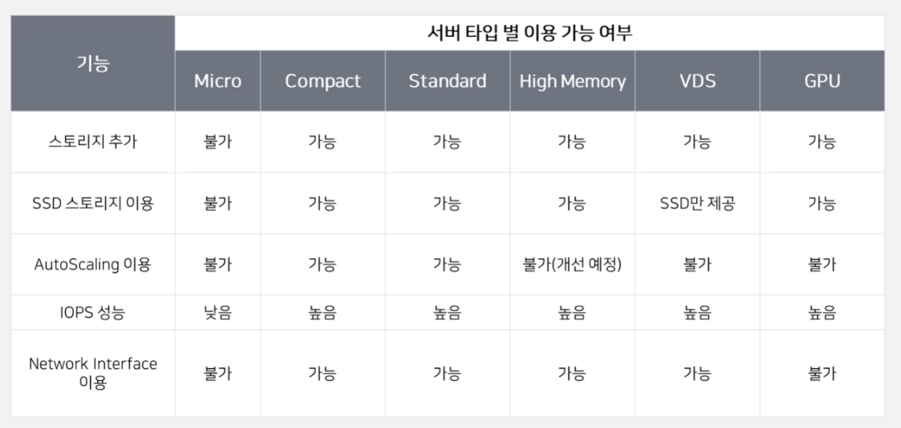

서버 Operation방법

- 웹 콘솔을 이용한 Operatio
  - Ncloud.com 콘솔을 이용하여 다양한 오퍼레이션 진행
- CLI Operation
  - 별도의 CLI툴을 설치하여 명령 프롬프트에서 명령어를 이용하여 Operation
  - S3의 경우AWS CLI를 이요하여 Operation
- API Operation
  - API를 이용해서 어플리케이션을 짜고 오퍼레이션할 수 있다.

# Lab1

- 서버 생성 Operation
  - 웹을 통한 서버 생성

NCP 대시보드

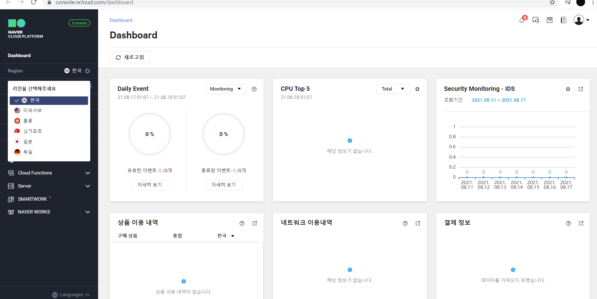

컴퓨트 카테고리의 서버를 만들어볼것이다.

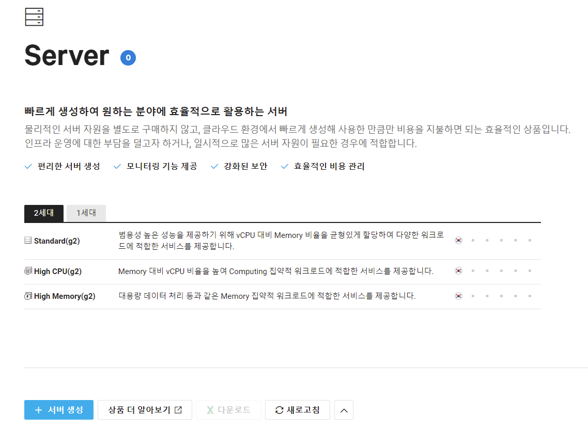

서버 생성창이다. 서버 생성을 눌러준다.

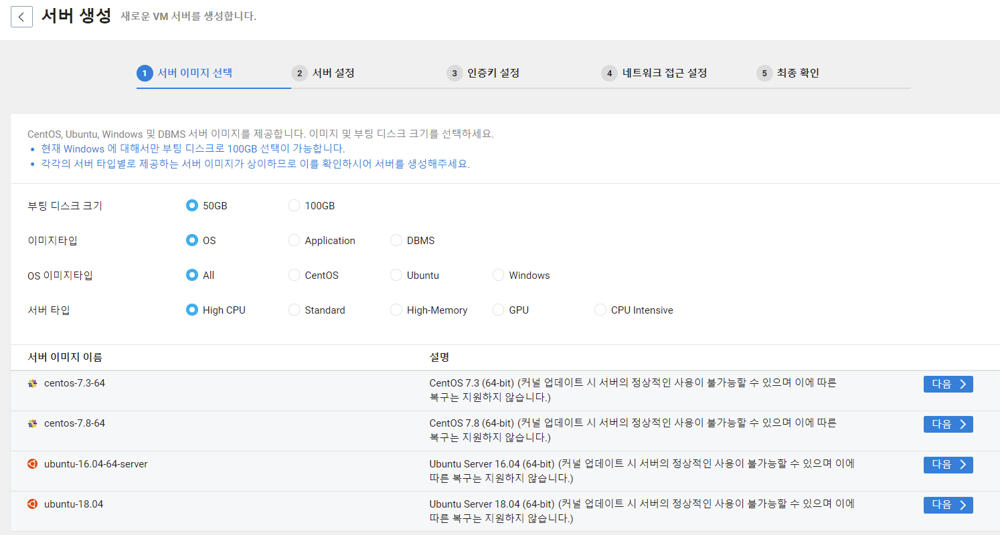

서버 생성창이고 디스크 크기를 정하거나 이미지 타입을 정할 수 있다. OS로 설정되어있는데 이것을 Application이나 DMBS로 바꾸면 

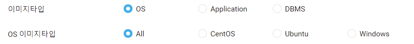

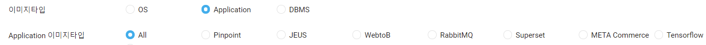

이런식으로 다양한 옵션으로 서버를 구동할 수 있다.

이번 Lab에서는 OS를 선택해 CentOS를 골라보겠다.

우측 하단의 다음 버튼을 클릭한다. 7.3-64bit버전

__위 과정이 Lab과 약간 달라서 VPC에서 진행하던 과정을 Classic으로 바꿔서 다시 진행__

아무튼 다음 화면으로 이동

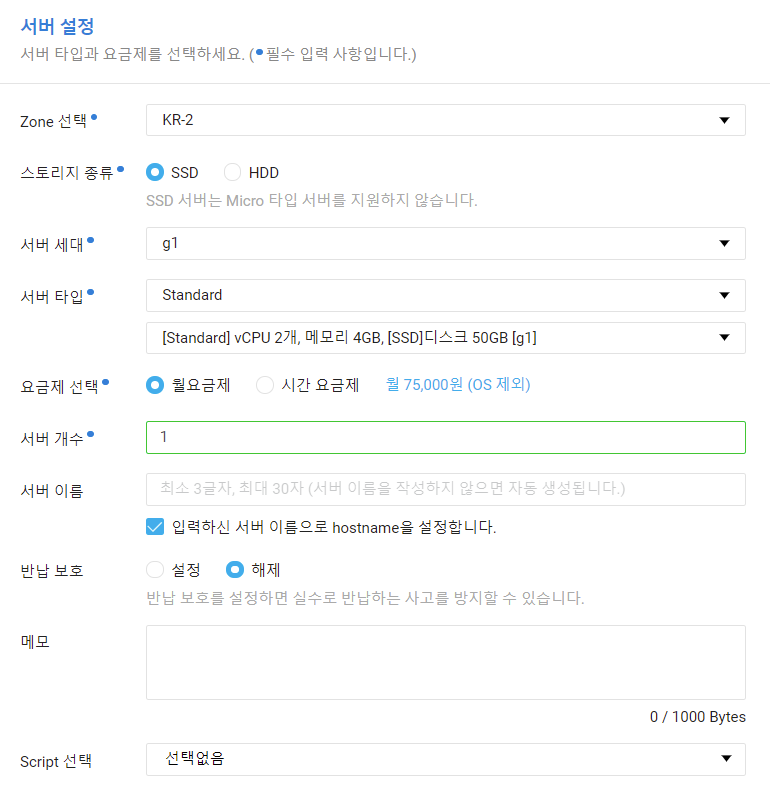

 스토리지 종류를 HDD로 하면 Max iops가 보장되지 않는다.

내 서버가 최소 어느정도까지 성능을 보장받고싶다면 SSD를 선택해야 max iops가 보장된다.

서버 타입마다 스펙이 다르고 

서버 이름을 설정해줄 수 있는데 

만약 서버를 한번에 여러개 생성하고싶다 그러면 

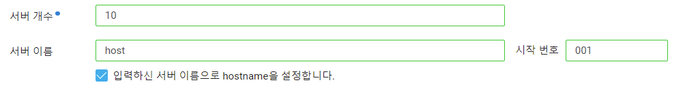

이렇게 번호를 지정해줄 수 있다.

마지막으로 스크립트를 선택해줄수 있는데 만들어 둔게 없으므로 우선 깡통 서버를 만들어 보겠다. 

다음을 누르면 인증키 설정으로 넘어간다.

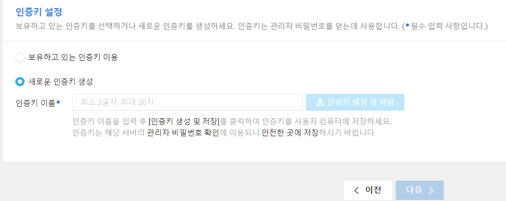

이름을 입력하고 pem키를 생성해주자. 

다음으로 넘어가면 

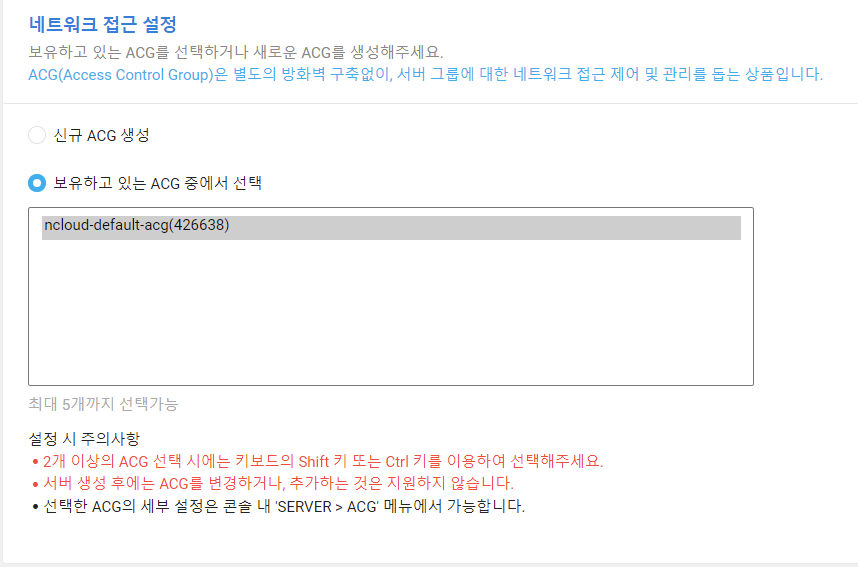

디폴트 ACG가 하나 있다.

테스트 서버이기 때문에 이걸 이용해준다.

서버는 기본적으로 비공인IP만 할당되기때문에 

기본적으로 외부에서 이 서버로 들어올 수 있는 방법은 없다. 

포트포워딩을 이용하거나 공인 IP를 등로해줘야만 서버를 이용해줄 수 있다.

또는 로드밸런서를 이용해준다면 외부에서 접속 가능할것이다.

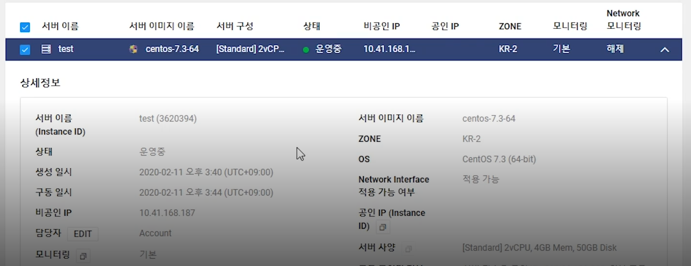

이렇게 서버가 구동된다. 

AWS와 크게 다르지 않다.
