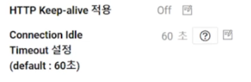
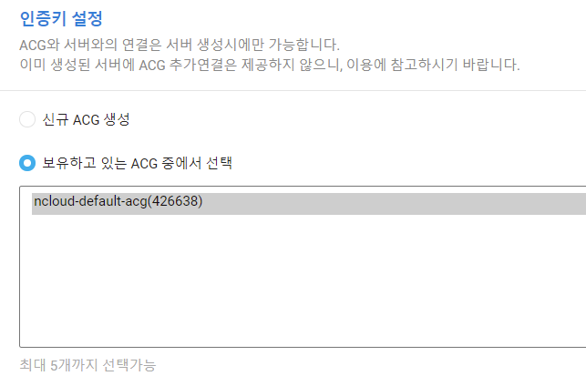

# NCP 네트워킹 실습

서버들을 로드밸런서로 묶고 DNS도 등록하고 어떤식으로CDN에 묶을 수 잇는지

오토스케일링까지 해보겠다

NCP 상품중 네트워킹 관련된 상품들이다. 여기서 로드밸런서를 선택해준다.

# Load Balancer

실제 로드밸런서를 외부에 노출시키기 위해 퍼블릭 IP를 선택해준다. 

서버간 통신을 위한 이중화를 위해서 프라이빗아이피의 로드밸런서를 구성할때 프라이빗 ip를 골라준다.

존을 선택할수있는데 멀티존을 선택하면 kr-1에 하나 kr-2에 하나 이렇게 두개가 생성이 된다. 

만약 kr-1만 선택을 하면 kr-1에 로드밸런서 두개가 설치가 된다.

프로토콜을 선택할 수 있는데 

로드밸런서는 OSI7레이어에서 레이어4에서 동작한다. 전송계층에서는 TCP의 포트에 대해서만 헬스체크를 하게된다. 

따라서 로드밸런서도 포트에 대해서만 헬스체크를 하게된다.

그런데 웹서버는 살아있지만 실제로 서비스는 동작하지 않는 경우가 발생한다.

즉 포트는 살아있지만 웹서버는 동작하지 않는 경우가 발생한다.

로드밸런서는 80포트가 살아있기때문에 트래픽을 넘겨주지만 

사용자는 에러페이지를 보게된다. 

L7 Health Check를 통해 포트 뿐아니라 웹 서비스가 제대로 동작하는지 판단할 수 있다.

L7 헬스체크는 3개의 프로토콜에 제공되고있다.( HTTP, SSL, TCP)

L7 헬스체크에서  URL이 `/` 로 루트인데 이 뒤에서는 index.html이 생략된것이다.

다음으로는 Sticky Session이라는게 있는데 한번 클라이언트가 3번 서버에 접속을 했다고 하면 A라는 클라이언트는 3번 서버로만 가게해주는 웹서비스에 국한된것이다.

특정클라이언트가 특정 서버에만 접속하도록 하는것

Source IP Hash랑 비슷한 기능을하지만 Source IP Hash는 IP를 기반으로 하고있고

sticky세션은 쿠키를 기반으로 하고있다. 

웹서버를 구성할거라 80 포트로만 서비스를 해주고, L7 헬스 체크를 해줬다.

참고적으로 말씀드리면 헬스 체크는 6초마다 체크하게된다. 

연속으로 3번 헬스체크 했는데 fail이 나게되면 언바인딩하게된다.

여기서 바인딩 언바인딩이란?

L4에서 밸런싱해주겠다는 용어를 바인딩이라고 표현하고

더이상 서버가 유효하지않기때문에 L4에서 서버를 제외하겠다. 라고하는것을 언바인딩이라고한다.

바인딩 언바인딩의 기준은 헬스체크를 6초마다 하되 3번 연속 Fail이 나거나 ok가 뜨면 언바인딩 또는 바인딩이다.

로드밸런싱 알고리즘은 

이 3가지 중에서 하나를 선택하도록 되어있다.

다음으로 넘어가면 로드밸런서에 어떤 서버를 넣을건지 선택하는 화면이다.

이후 생성을 누르면 로드밸런서가 생성된다. 

접속정보를 보면 IP가 아닌 도메인형태로 호스트 네임이 제공된다.

때문에 나중에 DNS에 로드밸런서를 등록할때 A레코드 타입이 아닌 CNAME레코드 타입으로 등록해줘야한다.

로드밸런서로 접속했을때

서버IP로 직접 접속했을떄

접속한 IP가 다른것을 볼 수 있다.

왜 다르냐면 프록시 방식이기때문에 서버입장에서 봤을때 클라이언트 아이피가 실제 아이피가 찍힌다면 

로드밸런서로 접속하면 로드밸런서의 IP가 찍히게된다.

DNS를 조회해보면 로드밸런서의 IP를 확인할 수 있다. 

서버를 다 만들게되면 HTTP Keep_alive와 

Connection Idle Timeout 설정이 있다.

이 설정은 웹서버에서 따로 설정을 해줘야만 유효하게된다.

이 다음은 DNS서버에 추가해보겠다. 

# DNS

Global DNS가 출시되면서 기존 DNS서비스는 서비스를 중단했다. 

실습에서도 Global DNS를 이용해보겠다.

도메인을 추가하면 위와 같이 레코드추가 창을 확인할 수 있다.

레코드를 추가해줄 때 A레코드 타입으로 추가를 해줄때는 ip로 등록을 해줘야하고

도메인이름으로 추가해줄때는 CNAME타입으로 등록해줘야한다.

등록하게되면

이렇게 추가가 완료되고

도메인 이름으로 접속해도 정상적으로 접속할 수 있게된다.

# CDN

네트워킹에서 

CDN+를 선택해준다. 

원본 경로를 지정해주고 

나머지 옵션들은 제공하고자 하는 서비스에 맞는지 제공하는 공식 이용문서를 참고해야함. 

Gzip과 같은경우는 동영상의 경우 거의 효과가 없다. 

아무튼 위 과정을 거쳐 CND을 생성해주면 원본파일이 저장되어있는 경로에서 이미지든 영상이든 가져와 파일을 캐싱해서 저장하고있다. 

캐싱을 얼마나 유지할지 선택하거나 

다양한 보안설정을 선택할 수 있다. 

- Referrer Domain을 사용하면 정상적인 경로로 접근해야지만 허용하겠다고 설정해줄 수 있다. 

- Security Token을 사용해서 허용된 사용자에게만 제공할 수도 있다. 

 

****

위 과정을 다 거치면 CDN이 생성된다. 

CDN이 생성되면 서비스도메인을 어디에 이용하느냐하면

위 페이지의 소스를 확인해 보면

이런 형태인데 

여기서 이미지를 불러오는 <img src='logo1.jpb' ... 이 부분에다가 CDN의 도메인을 넣어준다.

이렇게 넣어주면 웹서버가 아니라 CDN에 캐싱되어있는 이미지를 불러와서 

서비 비용과 트래픽 비용을 절감할 수 있다.

# 오토스케일링

오토스케일링 텝을 보면 

Launch Configuration과 Auto Scaling Group이 있다.

총 3단계의 설정이 필요한데

첫번째는 Launch Configuration

두번째는 Auto Scaling Group

세번째는 이벤트 그룹

Launch Configuration는 

서버의 스펙을 고른다.

오토스케일리을 통해 만들 서버의 스팩

서버 이미지와 인스크립트를 중복 적용해서

서버 생성시간을 많이 줄일 수 있게됩니다.

내 서버 이미지ㅔ엇 마스터본을 만들어놓고 해당이미지를 불러오고 

업데이트된 내용은 인스크립트를 통해 불러오는게 효율적이다.

이번 실습은 깡통서버를 가지고 오토스케일링을 해보겠다.

## Launch Configuration

1. 기본이미지

2. 서버 설정

기본적으로 시간요즘제가 되고 Init Script로 기본 동작을 설정해준다.

3.이름설정

4.인증키 설정

5.네트워크 접근 설정

6. 최종확인

Launch Configuration은 서버의 이미지를 설정해주는것, 스팩설정, 인증키 설정이 있고

중요한것은 ACG이다. 

오토스케일링을 통해 서버가 만들어졌는데 그 서버가 DB서버에 접속을 해야한다면

새로만들어진 서버가 DB서버의 ACL에 접속할 수있게 허용해줘야한다.

그래서ACG를 통해서 오토스케일링한 서버가 DB서버에도 접속할수 있게 되는것이다.

서버에 대한 스펙은 만들어졌고 이 스펙의 서버들을 언제 만들어주는지를 결정해 주는것이 Auto Scaling Group이다.

## Auto Scaling Group

1. 오토스케일링할 설정 선택

2. Auto Scaling Group을 설정

최대 30대 까지 오토스케일링으로 서버를 늘릴 수 있다.

처음에 몇대로 시작할지 시작 대수를 말한다.

기대 용량을 3대를 주면 처음 생성될때 3대가 생성되고 트레픽이 없으면 최소 용량까지 줄어들고 서버에대한 트레픽이 늘어나면 최대 용량까지 늘어난다.

- 쿨다운 기본초: 서버가 정상적으로 올라와도 부팅 이후에 서버 기동까지 일정기간 시간이 필요한다. 이러한 시간을 얼마까지 할당할지 설정하는것

- 헬스체크 보류기간: 로드밸런서로 지정하게 되면 로드밸런서로 되어있어도 로드밸런서가 바로 헬스체크하고 바인딩하는게 아니라 웹서비스가 올라오는데 일정시간 시간이 필요하기 때문에 헬스체크 보류기간동안 기다렸다가 바인딩하게된다.

- 로드밸런서: 기존에 만들어놓은 로드밸런서를 선택하게된다.

- NAT Gateway: 미리 만들어 놓은 NAT Gateway를 사용할 수있다??

- 반납정책: 보통 NCP에서 알아서 반납을 할것이다. 그런데 사용자가 서버가 반납되는걸 막아야 할 일이 있다면 고객이 API로 직접 지정을 선택할 수 있다. 

3. 정책설정

- 일정 설정은 예를들어 매주 수요일에 이벤트가 있다면 일정에 맞춰 오토스케일링을 설정해 놓는것

- 정책설정은 계획되어있지 않은 갑작스러운 트레픽 증가에 맞춰 능동적으로 대응하도록 설정하는것 

증감변경: 한대씩 늘릴건지

비율변경: %로 늘릴건지

고정값: 몇대로 늘릴건지

4. 통보설정

5. 검토 후 생성

****

오토스케일링 생성후 기대값으로 설정했던 3만큼 서버가 생성되는걸 확인할 수 있다.

## Group Event Setting

그런데 한가지 

언제 ADD정책을 쓰고 언제 Del 정책을 쓸지는 사용자가 정해주는 수밖에 없다.

Management의 Monitoring을 선택

모니터링에서 Group Event Setting을 선택

Group Event Setting에 들어가면

이렇게 볼 수 있고,

그룹 이벤트설정에 들어가보면

설정을 해줄 수 있다.

예시로 생성을 해보면

첫번째는 CPU사용량이 50%에 도달하면 add정책을 수행

두번째는 CPU사용량이 30%에 도달하면 del정책을 수행

