# Storage 서비스

오브젝트 스토리지

 나스

백업 

데이터 텔레포터

## Object Storage

- 인터넷상에 원하는 데이터를 저장하고 사용할 수 있도록 구축된 오브젝트 스토리지
  - 객체 기반의 무제한 파일 저장 스토리지
  - 콘솔, RESTful API, SDK 등의 다야앟ㄴ 방법으로 오브젝트들을 관리하고, 저당된 파일은 각 파일마다 고유한 URL이 부여되어 인터넷상에서 여러 사용자가 쉽게 접근가능
  - 정적 웹 사이트 호스팅 가능
- Object Storage특징 
  - S3 Compatibility API지원 (AWS S3와 호환) 기존의 서비스가 AWS를 이용한다면 별도의 코드 변경없이 NCP로 이용가능
  - Data Lifecycle 지원 (오브젝트 스토리지에 저장된지 일정시간이 지나면 좀더 저렴한 아카이브스토리지로 이동된다는것)
  - Sub Account 와의 연동으로 접근 제어가능 
  - CDN, Transcode, Image Optimizer, Cloud Hadoop, Cloud Log Analytics와 같은 NCP 내 다양한 상품과 통합/연계 지원

## Archive Storage

- 데이터 아카이빙 및 장기 백업에 최적화된 스토리지 서비스
  - Infrequent Data 백업 및 Archiving Data 보관을 주 목적으로 하는 스토리지
  - Object Storatge 보다 데이터 저장 비용은 저렴, 데이터 처리 API비용은 비쌈
- Archive Storage 특징
  - 콘솔, API(swift, s3), CLI, SDK를 이용해 데이터 관리 가능
  - 데이터 최소 보관 기간없이 사용할 수 있음
  - 오브젝트 생명주기 관리 ()
  - sub Account를 연동해서 접근을 제한해줄 수 있다.

## NAS

- 다수의 서버에서 공유하여 사용할 수 있는 스토리지

  - 최소 500GB에서 10TB까지 구성 가능, 추가는 100GB 단위로 추가 가능
  - NAS 가용량 안에서 생성된 스탭샷 이미지 이용해서 데이터에 대한 복구 기능 제공 (약간 백업 개념, 나스의 스냅샷에서 복원할 수 있다. )
  - 프로토콜은 NFS / CIFS제공 
    - ( NFS: 리눅스서버들끼리 공유를) (CIFS: 윈도우 서버들끼리 공유) 둘중 하나 반드시 선택
    - NFS: IP를 통해 접근제어
    - CIFS: 아이디 패스워드로 접근제어
    - NFS는 초기 접근가능 IP를 설정
    - CIFS는 초기 아이디 패스워드 설정
  - 서버 사설 IP 이용한 ACL 오픈으로 타 계정 서버에서도 마운트하여 사용 가능

  

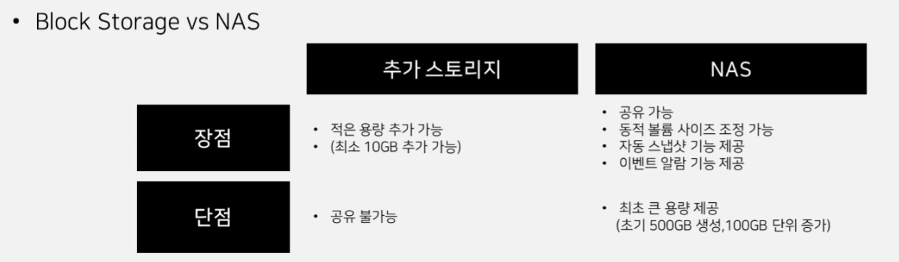

블록스토리지

- 블록 스토리지는 최대 15개까지 추가 스토리지를 추가할 수 있는 장점

- 적은 용량도 추가 가능  10GB~ 2TB씩 추가 가능

- 단점으로는 공유가 불가능.

NAS

- 동적볼륨사이즈 조정 가능 (서버에 마운트된 상태로 볼륨사이즈를 조절가능)
- 자동 스냅샷
- NAS의 단점. 최초의 용량자체가 초기 500gb부터 100GB이상씩 증가시켜야한다는 단점

## Data Teleporter

대용량 데이터 이전을 위한 효과적인 솔루션

- 대용량 데이터 (최대 100T) 이전을 위한 전용 어플라이언스 대요 서비스 
- 네트워크 비용 절감, 안전하고 빠른 데이터 이관이 가능한 서비스 
- 이관 데이터를 NCP Object Sorage / NAS에 Import

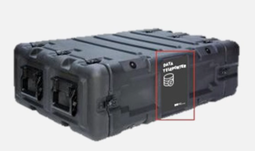

NCP 직원이 고객사에 방문해서 

NFS, CIPS FTP같은 프로토콜을 통해 

네이버클라우드의 IDC로 가져와서 데이터를 이전

## Backup

- 서버 내 파일 및 Preinstall DB에 대한 백업 설정
  - 백업 요청서 작성하여 신청하고 서버에 Agent를 설치하면 끝(ncloud.com > 고객지원/FAQ> 자료> 백업요청서)
  - 백업수행주기로 8가지 옵션 제공(1회성, 1일 1회 전체백업, 1주 1회 전체백업, 1주 1회 전제백업&매일 증분 백업 등)
  - 최대 24주까지 백업 파일 보관 가능

백업 요청서를 작성. 어떤 폴더, DB를 사용하고있고 어떤 파일을 백업할지 요청서를 작성

그러면 에이전트를 받게되고 에이전트를 설치하게되면 자동으로 해당 에이전트가 백업을 하게된다. 

# Lab 4

- Object Storage생성
- Lifecycle Management생성
- NAS생성

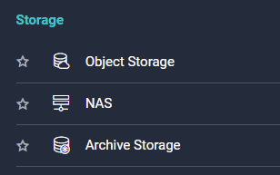

## Object Storage

버킷 생성 이전에 이용신청을 해주면

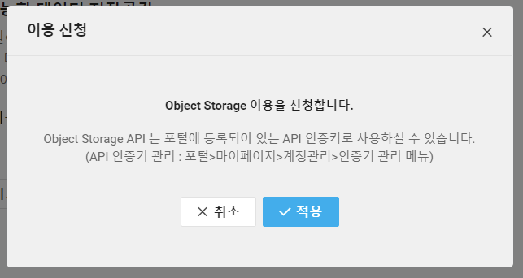

인증키 관련 안내가 나오고

안내에 나온 경로에 들어가보면 인증키를 관리할 수 있다.

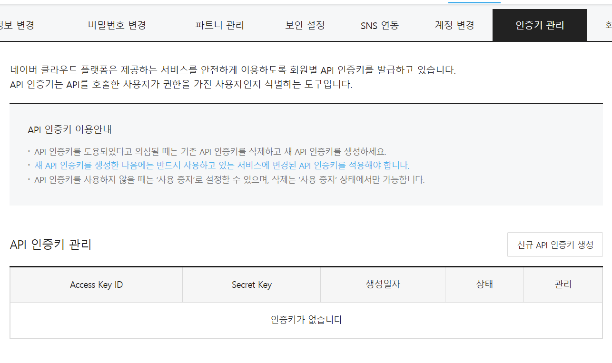

그럼 본격적으로 Object Storage Bucket을 생성해보겠다.

### 기본정보입력

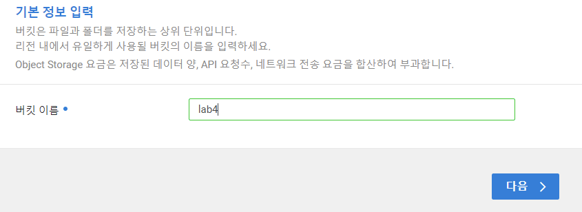

### 권한관리

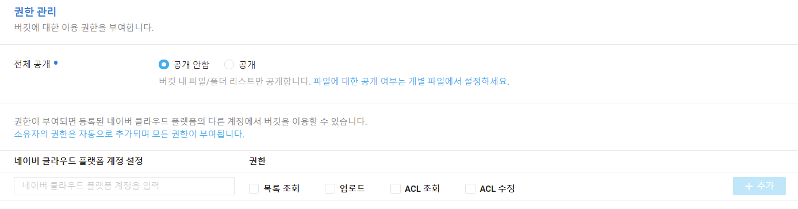

### 잠금관리

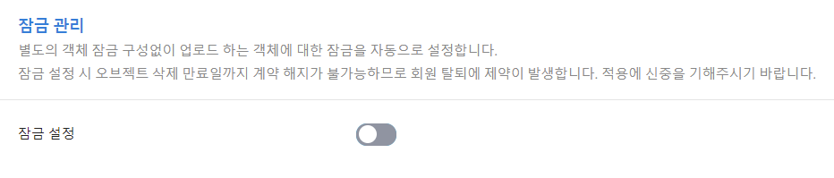

### 최종확인

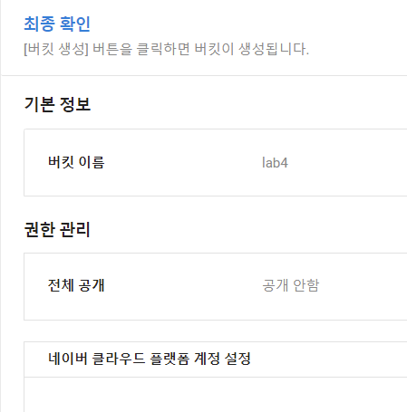

이렇게 간단하게 버킷을 생성했다.

생성한 버킷에 데이터를 저장하는 방법으로는 웹 콘솔을 이용하거나 서트파티툴, 또는 API를 이용할 수 있다.

보통은 API나 SDK를 이용해서 데이터를 넣고 빼게된다.

콘솔의 사이드바를 보면 

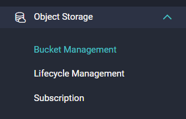

Lifecycle Managerment를 이용해서 일정시간이 지나면 아카이브 스토리지로 저장하도록 설정해줄 수 있다.

하지만 아카이브 스토리지에 저장하고 읽고 쓰기를 반복한다면 원하는 성능을 얻지 못할것이다.

## Archive Storage와 Lifecycle 설정

archive storage는 거의 원클릭으로 생성이 되었고 생성한 Archive storage를 이용해서 Object storage의 Lifecycle 을 설정해줄 수 있다.

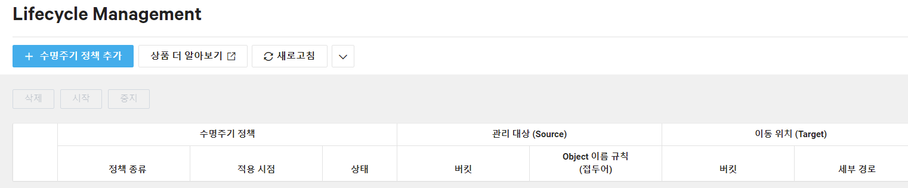

### 수명주기 정책 추가

- 정책
  - 만료 삭제: 이동시점이 되면 삭제
  - 이관: 이동시점이 되면 이동
  - 이관 후 삭제 : 이동시점이 되면 이동 후 삭제

이관이나 이관 후 삭제를 선택하면 이관할 Archive storage를 선택할 수 있다.

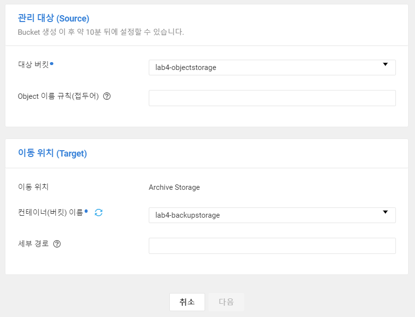

완료하면 다음과같이 생성이 된다. 

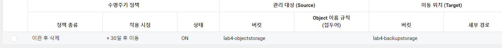

## NAS

### NAS 볼륨생성

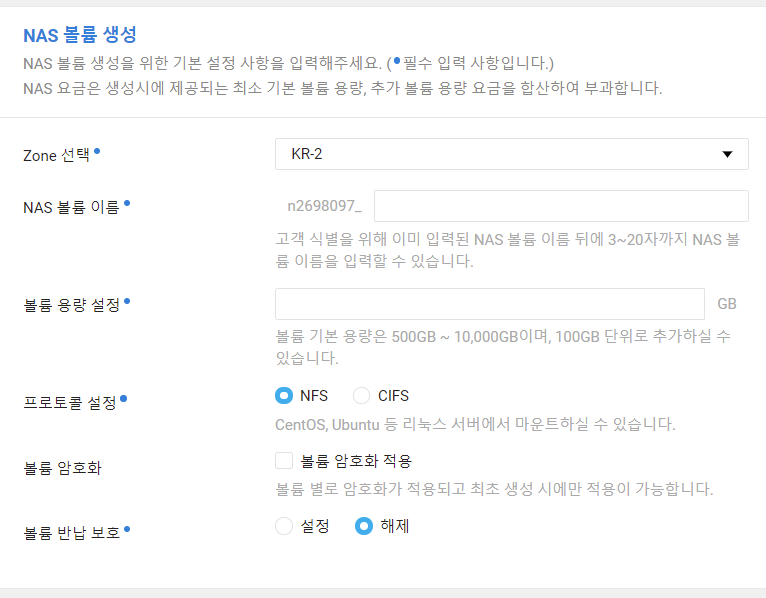

- 내가어떤 zoon에 nas를 설치할지 선택
- 볼륨 용량 선택
- 프로토콜을 NFS 와 CIFS중 선택할 수 있다. 

NFS 접근제어설정

- 서버의 IP를 통해 접근설정을 해줄 수 있게된다. 

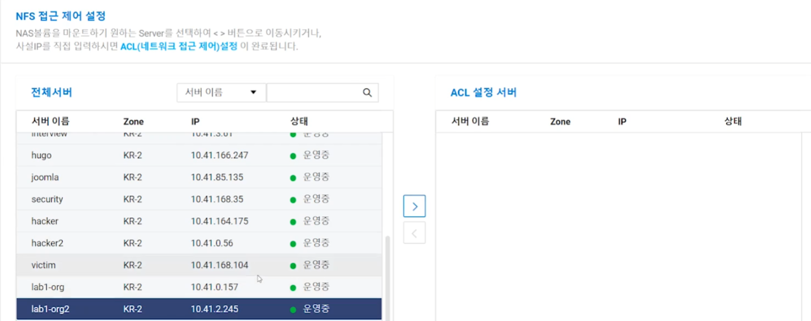

CIFS를 선택하게되면 

- 아이디와 패스워드로 접근설정을 해준다.

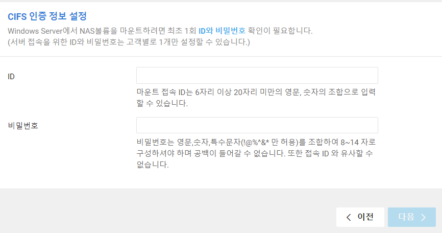

- 생성완료

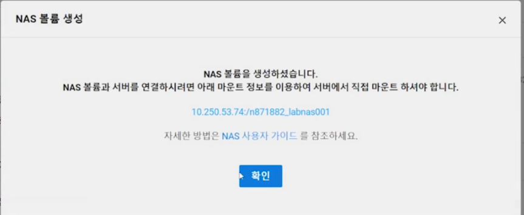

이후 스냅샷, 스토리지 동적추가를 해줄 수 있다.

스냅샷을 이용하면 500GB NAS에서 100GB는 스냅샷이 저장되는 공간으로 할당된다. 
