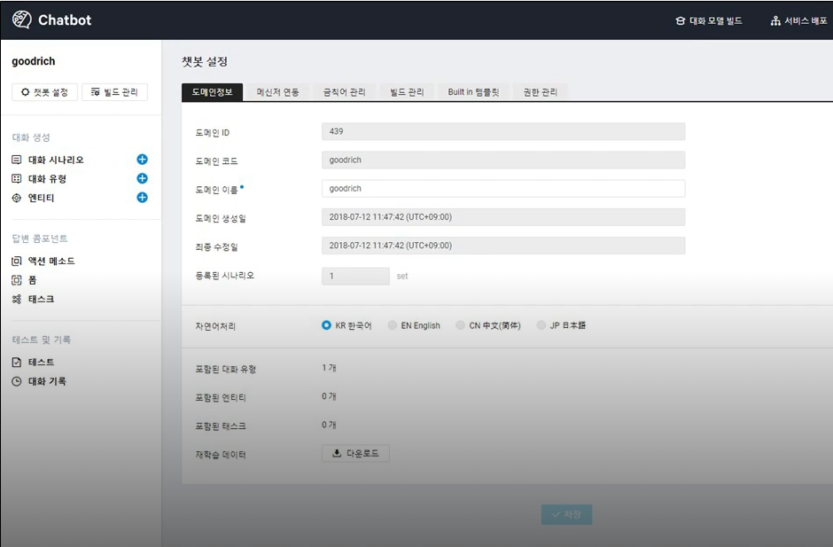
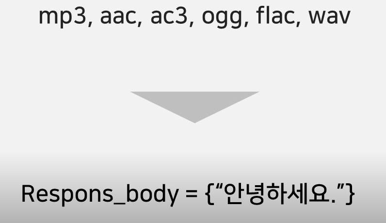
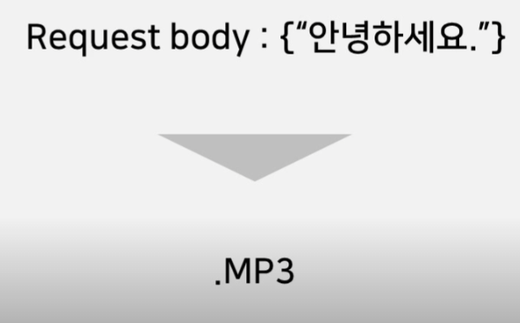
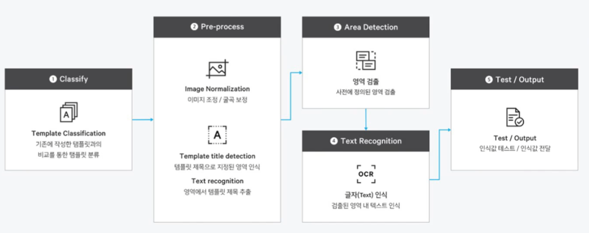

# AI&Application

### 네이버클라우드플랫폼 AI

- AI플랫폼인 Clova, 번역 서비스인 Papago
- 딥러닝을 위한 Tensorflow가 탑재된 서버 이미지 제공(Centos 7.3, Ubuntu 16.04)

b2b서비스 제공

대부분의서비스 API로 제공

딥러닝을 위한 텐서플로우를 탑제한 이미지 제공

### 네이버클라우드플랫폼 Application

- 네이버에서 사용하는 기술과 서비스를 API로 제공
- Geolocation, Maps, nShortURL, SENS, Search Trend등 제공
- 네이버 통합검색 서비스를 통해 수집되는 검색어 통계를 다양한 기준으로 조회하고 활용
- 대량 메일 발송을 위한 Outbound Mailer
- 고객 대응에 활용할 수 있는 챗봇

대부분의서비스 API로 제공

딥러닝을 위한 텐서플로우를 탑제한 이미지 제공

다양한 기술을 API로 제공

## 챗봇

봇이 채팅을 해주는 챗봇

- CS나 주문 시스템과 같은 고객 대응을 로봇으로 대체하는 상품
  - 학습을 통해 적절한 답변을 자동화, CSR, CSS와 연동을 통해 메신저 뿐만 아니라 음성 채팅까지 확장 가능
  - 라인, 톡톡, 페이스북 메신저와 연동

고객문의에서도 많이 활용

해당 챗봇을 이용해서 궁금한 내용을 질문하면 챗봇이 답변

ARS CS와같은 주문시스템에서 고객대응에서 많이 쓰인다.

톡톡 라인 페이스북 메신저 웹 페이지, 클로버 스피커에 연동해서 사용할수 있다. 

챗봇이라한다면 실제로 챗봇을 이용한 도메인널리지를 구성하고 다양한 방식으로 챗봇시나리오를 구성할 수 있게된다.

챗봇 엔진을 통해 대화 시나리오를 구성할 수 있고 테스트를 통해 어떤 작업에 어떻게 준비할것인지를 선택할 수 있다.

## Clova Speech Recognition(CSR)

- 음성을 텍스트로 변환
  - 국내에서 가장 높은 한국어 인식률
  - Android 및 IOS SDK 제공
  - Rest API제공
  - 한국어, 영어, 일어, 중국어(간체) 제공

음성기록을 테이프로저장하고있다면 이를 텍스트로 검색하기위해선 녹취된 내용을 타이핑 해야할것인데 CSR을 이용하면 음성데이터를 텍스트로 전환이 가능하다. 

안드로이드에서SDK로 제공하기도 하지만  

Rest API를 이용해서 mp3, aac, ac3, ogg, flac, wav파일을 전달하면 택스트를 반환한다.

## Clova Speech Synthesis(CSS)

- 텍스트를 음성으로 변환

  - 자연스러운 합성음
  - 총 9개의 음색 제공(언어별 2개 이하)
  - Rest API제공
  - 한국어, 영어, 일어, 중국어, 스페인어 제공

  

Rest API를 제공하므로 텍스트를 전달하면 음성을 반환한다. 

## Clova Premium Voice

- 사람의 음성에 가까운 고품질 합성음 제공
  - 실시간 음성 생성이 가능한 Neural Vocoder를 사용하여 실제 사람의 음성에 가까운 자연스럽고 깨끗한 합성음을 제공
  - 입력한 텍스트를 RESTful API 방식으로 전달하면 서버에서 인식해 mp3 포맷의 스트리밍 데이터나 피일로 리턴
  - 엄격한 뉴스 앵커 스타일, 부드러운 친구 스타일, 담백한 일반인 스타일 등 다양한 감정과 스타일의 합성기가 제공될 예정

## Clova OCR

광학적인 사진과 같은 이미지 안에서 캐릭터를 추출해내는 서비스를 OCR이라고 하는데 기존의 OCR과 몇가지 다른것이 있는데 

가장큰 차이는 템플릿이다. 

템플릿에 key value를 가지고있고, 

예를들어 하나의 포멧에서 다양한 데이터가 있을것인데 이 데이터를 저장하고자 한다면 단순하게 OCR에서 텍스트를 추출하게된다면 텍스트만 추출하게된다. 

그러면 그 텍스트를 다시 어느 포멧의 데이터인지 구분하는데 많은 리소스를 소모하게될것인데 

템플릿을 미리 지정해두면 템플릿의 각각의 필드에 텍스트가 하나의 쌍으로 __키 벨로 데이터를 추출__하게된다.

1. 템플릿 생성
2. 이미지 보정,
3. 사용자가 입력하는 이미지에서 영역 검출
4. 글자 인식
5. 인식값 전달

## Papago NMT(Neural Machine Translation)

- 통계 기반 번역

  - 번역할 언어의 종류를 자동감지
  - 학습을 통해 높아지는 성능
  - RestAPI 제공
  - 자연스러운 번역 기술 제공
  - 영어, 일어, 중국어 제공

  

사용자가 번역하는것이 아니라 비지니스모델에서 번역서비스를 제공할 수 있는 b to b서비스이다. 

파파고중에서도 NMT (인공신경망 머신 번역기법)을 이용하기때문에 훨씬더 자연스러운 번역을 제공한다.

이 텍스트를 어떤 언어로 번역할것인지 결정.

## Pose Estimation

- 이미지내의 주요 신체 영역을 인식하고 해당 영역을 좌표로 변환
  - 이미지를 분석하여 신체 영역 좌표를 결과값으로 제공
  - Restful API 방식으로 제공
  - 이미지는 2MB 이하로 제한

특정 사진에서 얼굴은 어디에있는지 코는 어디에있는지 무릎은 어디에 있는지 좌표를 추출한다. 

JOSN포멧으로 결과값이 나오게되는데 스코어는 실제로 정확도를 말한다.

번호로 코인지 입인지 필드를 구분한다.

좌표값으로 해당 필드가 어디에 존재하는지 확인 가능하다.

운동사진을 분석해 포즈를 교정하는데 쓰이기도 한다.

## Object Detection

- 이미지내의 객체를 탐지하고 객체를 분석
  - 객체를 탐지하여 객체의 이름, 바운딩 박스, 탐지 정확률을 제공
  - RESTful API 방식으로 제공
  - 이미지는 2MB 이하로 제한

