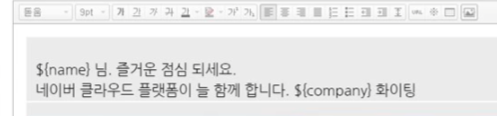

# NCP Application

## Geo Location

- 사용자IP를 통해 위치 정보를 제공하는 국내 유일의 서비스
  - 고객서버에서 질의한 IP주소에 따른 지역정보 DB를 검색해 국가, 시/국/구, 동, 인근 지역의 좌표 정보 전달
  - 접속 IP를 기반으로 동까지 확인 가능(국내), 해외의 경우 주까지 확인 가능.

## SENS

- Simple & Easy Notification Service
  - SMS와 APP Push를 손쉽게 전송
  - 웹을 통해서 혹은 API를 이용하여 다수의 사용자에게 SMS, Push발송
  - SMS의 경우 건당 9원

웹 콘솔에서도 보낼 수 있고, 텍스트파일로 주소록을 import할 수 있어서 대량 발송도 가능하다.

회원가입, 인증할때 데이터베이스의 정보를 기반으로 사용자에게 문자 발송이 가능하다.

이때 보통 API를 이용하게되고 Swagger(스웨거)를 통해 어떤 옵션을 바꾸냐에 따라 결과가 어떻게 바뀌는지 실시간으로 확인할 수 있다.

실제 사용자들에게 문자나 웹푸시를 보낼 수 있게된다. 

## Outbound Mail

- 대량 메일 발송을 위한 메일 발송 상품
  - 광고메일 발송을 위한 템플릿 기능, 법적인 기능(제목에 광고 문구 삽입 및 수신 거부 기능) 제공
  - 템플릿에는 네이버 메일과 동일한 입력기인 스마트 에디터를 제공하고 치환 태그 기능을 통해 변수 사용 가능

주소록에 name컬럼과 company컬럼이 있다면 그에 매칭되는 변수를 이용해서 다음과 같이 문자를 발송할 수 있다.

콘솔을 이용할 수 있지만 API도 제공하고있다.

API를 제공하는 이유는 플랫폼의 성격이기 때문에 실제로 웹 콘솔에 들어와서 작성하기보다는 단순하게 API를 콜해서 이용할 수 있게 했다.

