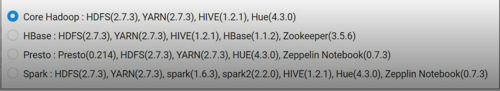

# Analytics

- 서비스와 관련된 다양한 로그를 수집하고 분석
  - ELSA를 통해 모바일 앱에서 발생하는 크래시를 수집하고 분석
- 시스템의 다양한 로그를 수집하고 분석
  - CLA를 통해 시스템의 로그를 수집하고 분석
- 웹 페이지에 대한 통계 분석
  - RUA를 통해 웹페이지의 방문자 통계를 확인

## ELSA(Effective Log Search&Analytics)

Effective Log Search & Analytics

- ElSA의 SDK/API를 이용하여 어플리케이션을 쉽게 저장하고 검색, 분석할 수 있는 로그 분석 툴
- 특정 로그 발생시 알람을 보내는 이벤트를 기능과  App Crash Report도 제공 예정

크래시가 발생했을때 그 정보를 분석해서 이를 회피하기위해서 어떻게 해야하는지 알려주는 모니터링 서비스

특정 로그에는 사용자에게 알람을 보내고 크래시를 피하는 방법을 가이드해준다. 

## CLA

시스템 로그 수집 분석 플랫폼

- Agent 기반으로 동작
- Syslog, Apache Log, MySQL, Tomcat Log, Windows Event Log, MS-SQL error Log 수집
- 커스텀 로그 기능을 통해 직접 로그 대상 지정 가능
- Object Storage와 연계되어 로그파일 보관 기능 제공

클라우드 로그 분석의 약자

다양한 로그들을 수집 분석해주는 서비스

일반적으로 리눅스는 유사한 서비스가 시스로그라는 서비스가 있고, 윈도우에도 이벤트를 한곳에 모아 보여주는 서비스가 있다. 

NCP의 CLA에이전트가 로그를 다 모아서 보여주는 기능을 한다. 

CLA는 에이전트 기반. 템플릿으로는 Syslog, Apache Log, MySQL, Tomcat Log, Windows Event Log, MS-SQL error Log 수집

커스텀 로그를 이용할때는 반드시 텍스트 파일이어야하고 이게 쌓이게 되면 CLA 서버로 전송하게 된다.

100GB의 저장소를 제공한다. 

이를 초과하면 오브젝트 스토리지로 임포트 시켜야한다.

사용자가 로그가 너무 많이 쌓이면 CLA는 가장 오래된 로그 30%가 삭제된다. 

이런식으로 로그가 계속차면 30%씩 삭제하게된다. 

## RUA

웹페이지 접속자 분석도구

- 구글 애널리틱스와 유사한 상품으로 웹페이지 접속자에 대한 분석, 통계

웹페이지에 누가 들어왔는지 PV는 얼마고 UV는 얼마인지 

유저가 어떤 브라우저를 사용하고있는지 정보를 뽑아낼 필요가있다.

타 밴더에 데이터가 전송되는데에 우려가 있다면 RUA를 이용한다면 네이버 플렛폼에 정보를 저장하고 데이터를 분석할 수 있다.

## Cloud Hadoop

빅데이터 분석도구

- 하둡 클러스터를 보다 쉽고 편리하게 생성 및 관리
- Apache Ambari를 제공하여 하둡 클러스터의 관리 및 모니터링을 효율적

기본적으로 4가지 타입으로 사용자가 빅데이터를 분석할때 컴포넌트를 다 설치하진 않을것인데 어떻게 분석하느냐에 따라 설치되는 컴포넌트가 달라진다. 

좀더 편리하게 하둡 클러스터를 구축하고 분석할 수 있도록 4가지 타입의  하둡 클러스터를 제공하고있따. 

## Cloud Search

사용자의 웹사이트에 검색 기능 제공

- 다양한 인덱싱 구성 옵션 제공
- 다국어 및 불용어, 동의어 처리 기능 제공
- 네이버 형태소 분석 처리기를 기반으로 한국어 처리

텍스트 검색은 일반적으로 데이터베이스 안에서 쿼리를 이용하게된다.

대표적으로 MYSQL에서 LIKE절을 이용해서 검색을 하는것인데 

내가 원하는 텍스트 키워드가 들어가있는 문장만 추출하게된다.

네이버의 클라우드 서치는 서치 엔진에 사용자의 문서를 분석을 시켜서 실제 사용자가 네이버의 검색엔진을 쓰는거와 동일한 효과를 사용자가 누릴수 있게된다.

클라우드서치 상품을 쓰게되면 사용자는 검색엔진이 인덱싱을 통해서 해당 문서에 인데싱을 걸고 API를 통해 검색을 하게된다.???

## Elasticsearch Service

Elasticsearch 클러스터를 손쉽게 배포, 보호, 운영 및 확장하여 로그분석, 검색, app모니터링 등을 수행할 수 있도록 제공하는 완전 관리형 서비스

- Elasticsearch service 클러스터는 1대의 매니저 노드와 3대 이상의 데이터 노드로 구성(데이터 노드 수는 설치 시 원하는 만큼 증설가능)
- Elasticsearch service는 데이터 분석 및 시각화 플랫폼인 Kibana와 연계되어 데이터를 빠르게 정확하게 분석 가능

가장 큰 장점은 오픈소스이고 검색결과에 대한 퀄리티가 굉장히 뛰어나다.

상당히 많은 시간과 노력이 든다. 

때문에 네이버클라우드에서는 사용자가 좀더 편리하게 

빠른 검색을 원한다면 사용자가원하는 만큼 노드를 증설한다.

Kibana와 연계되어 데이터를 빠르게 분석

## Global Regin

글로벌 리즌은 리전간 전용선으로 연결되어있어서 우회를 통해 전송이 가능하다.

일반적으로 쓰는 인터넷의 편차는 크지 않다.