# 클라우드 Database

- 자동 Fail-Over 지원 및 사용자 환경에 맞는 구성 가능

  최대 32vCPU에 256GB메모리 지원, 2TB 자동 디스크 확장 (Standard, High Memory)

  자동 Fail-Over를 지원하며 최대 5대까지 복제 Slave(Read Only) 확장 가능

  ​	(마스터 서버가 죽더라로 스텐바이서버가 마스터로올라오고 새로운 스텐바이서버가 만들어짐 )

  Private Load Balancr를 이용해서 Read 부하 분산 가능

  ​	(슬레이브서버들은 로드밸런서로 묶어서 Write쿼리는 마스터에 날리고 READ쿼리는 슬레이브에 날려서 서버의 부하를 분담한다.)

  자동 백업 주기를 설정할 수 있으며, 최대 30일 백업 파일 보관

DB 인스턴스 즉 접속권한에 대한 정보만 가져가고 서버에 대한 관리권한 DBMS의 관리 권한은 NCP에서 관리한다.

서비스에 큰 영향을 준다. 

지속적으로 서비스를 가능하게 해주는 기능.

### Master DB Failover

- 콘솔에서 수동(Manual)으로 Failover를 실행할 수 있습니다. (사용자의 서비스에 어느정도 영향이 있는지 테스트, 어느정도 시간을 감내할 수 있는지 측정할 수 있게된다.)

- 서비스 오픈전에 Master DB장애로 Failover가 발생하는 상황을 재현하여 Application에 영향이 없는지 사전에 점검을 할 수 있습니다. 

### DB Process 모니터링

- DB Server 연결하여 수행중인 Query를 확인할 수 있습니다.
- Slow Query 로그 외에도 특정 시점에 어떤 Query가 수행중인지 확인할 수 있어 DB상태를 점검하는데 도움을 받을 수 있습니다

### Stand Alone 백업

- Stand Alone 서버도 DB 백업을 사용할 수 있습니다.

- 데이터가 삭제되어도 백업 보관일 설정 내에서 백업으로 데이터를 복구할 수 있습니다.

  (마스터와 스텐바이로 이루어지는게 기본이라면 마스터로만 DB를 구성하겠다. 즉 Failover를 감내하겠다고 옵션을 )

  (백업 데이터를 이용하는 케이스는 데이터 추출이 대부분인데 스텐다드까지 만들어서 데이터를 추출할 필요가 없기때문에

백업 데이터를 이용하는 케이스는 추출하는 경우인데 스텐바이까지 데이터를 추출할 필요가 없기때문에 이용한다.)

## Cloud DB for Redis

- 자동 복구를 통해 안정적으로 운영되는 완전 관리형 클라우드 __인메모리 캐시 서비스__

  - Redis가 제공하지 않는 자동 Fail-over기능을 독자적으로 개발하여 제공함으로써 장애발생시에도 안정적인 서비스 제공
  - 설치 후 Redis와 OS모니터링을 이용할 수 있으며 장애 또는 이벤트 발생 시 사용자의 메일, SMS로 장애 알람
  - 네이버 서비스에서 오랜 시간 검증된 Redis 설정을 기본으로 지원
  - Redis Cluster 미지원(향후 지원 예정)

  

실제로 DB안에 있고   더 빠르게 하기위해 앞단에 Redis를 두기도하고 Redis자체를 DB로 구성하기도하는데 Cloud DB for Redis의 가장 큰 장점은 기존 Redis가 제공하지 않는 Failover를 제공해준다는것

전통적으로 Redis같은 경우에는 캐시 메모리를 늘리는 클러스터 구성을 하게되는데 

향후에 지원할 예정이다. 

## Cloud DB for MS-SQL

- 네이버 서비스에서 검증된 최적화된 설정을 통해 안정적으로 운영되며, 장애가 발생하면 자동으로 복구
  - 안정적인 서비스 제공을 위해 장애 발생 시 자동 Fail-over기능 제공(Principal DB와 Mirror DB 총 2대 생성)
  - 설치 후 즉시 MSSQL과 OS 모니터링을 이용할 수 있으며, MSSQL의 동작 상황을 그래프를 통해 쉽게 확인 가능
  - 1분 단위의 쿼리 레벨 성능 분석을 지원하여 서비스 성능과 안정성을 향상

MYSQL에서 사용하던 마스터와 슬레이브 대신

mssql에서는 Principal DB와 Mirror DB를 이용한다.

****

# Lab 5

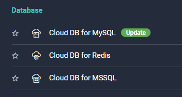

## Cloud DB for MySQL 생성

### 서버 설정

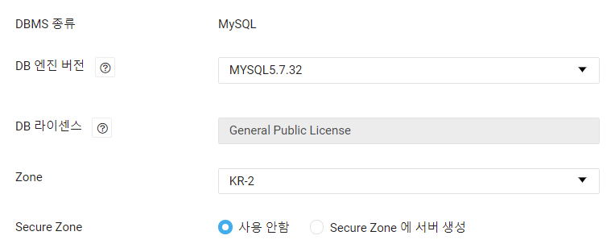

- DBMS 종류 
- DB엔진 버전
- DB 라이센스 
- Zone 
- Secure Zone

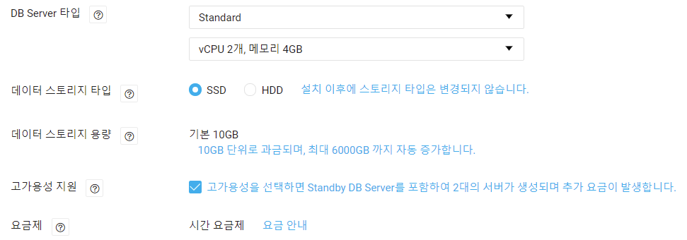

- DB Server타입: 서버의 스펙을 결정
- 데이터 스토리지 타입: SSD와 HDD중에 결정
- 데이터 스토리지 용량: 실제로 용량만큼 과금이 되는데 10GB부터 10GB씩 증가가되고 6TB까지 증가됨
- 고가용성지원: 마스터와 스텐바이 서버 두개를 만든다는 의미, 체크를 해제하면 마스터만 생성됨

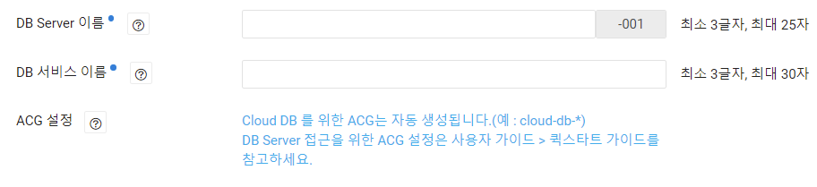

- DB Server이름: 이름을 설정하고 뒤에 붙는 숫자는 큰 의미는 없고 001 002 순으로 마스터 슬레이브가 생성된다.

- DB 서비스 이름: 

- ACG 설정 : DB를 생성하면 서버를 애워싸는 ACG가 자동으로 생성된다. 

  나중에 서버에서 DB로 접근할때 ACG에서 접근할 서버를 열어줘야한다.

### DB설정

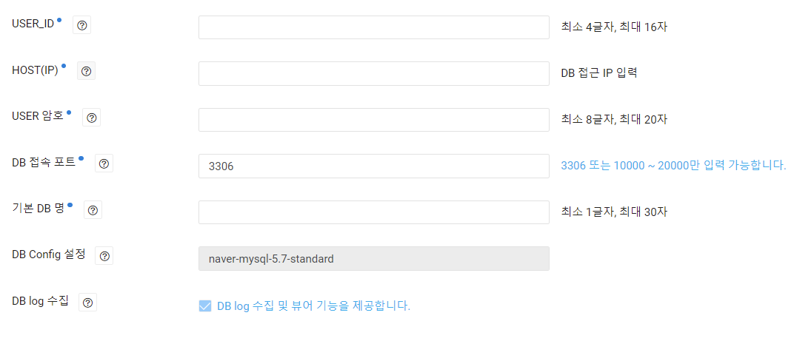

- DB에 대한 설정

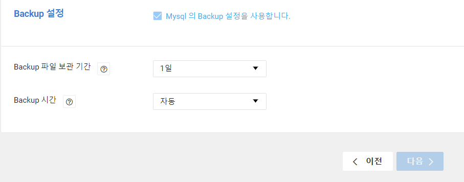

- Backup은 디폴트로 하도록 설정되어있다.

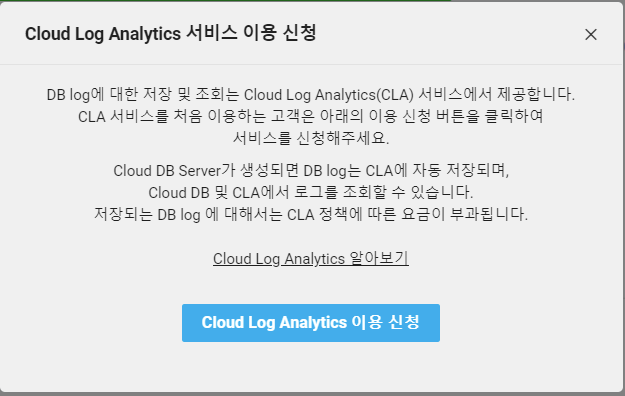

이후 최종확인 후 생성된다. 

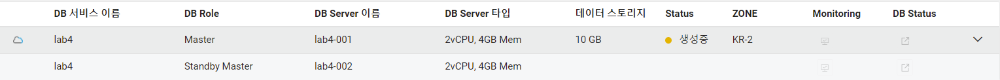

두대가 생성되는것을 확인할 수 있다.

- 서버를 생성하면 Private 도메인이라는게 나온다. 데이터베이스에 접근하기위한 접속경로가 되는것이고,

  mysql 어플에 접속할때는 반드시 IP가 아니라 프라이빗 도메인으로 접속하셔야하고 

  Public도메인은 외부에서 접속할때 사용하는데 Public 도메인 관리에서 도메인을 신청하면 외부에서 접속가능한 도메인이 할당된다.

- Slave를 추가할수 있다.

Read 쿼리를 분산하겠다 하면 슬레이브 서버들을 추가할 수 있다. 

- DB 용량도 언제든지 변경할 수 있고

- 사용자의 권한도 부여할 수 있다.

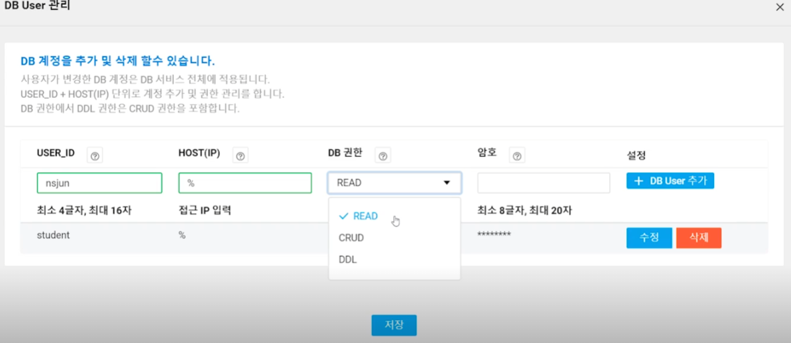

- Master DB Failover

  강제로 Failover시켜주는것

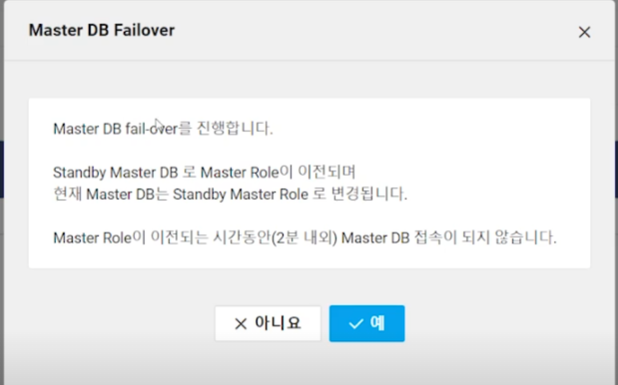

서비스에 어떤 영향이 있는지 알아보기위한 기능

모니터링에서 DB의 상태를 확인할 수 있고, 

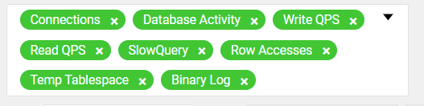

Query Timeline은 언제 쿼리가 날라왔는지 확인할 수 있다.

백업

시점복원을 통해 분단위로 시점복원이 가능하다.

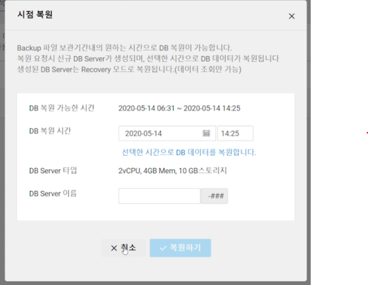

