# Intellij 개발환경 준비

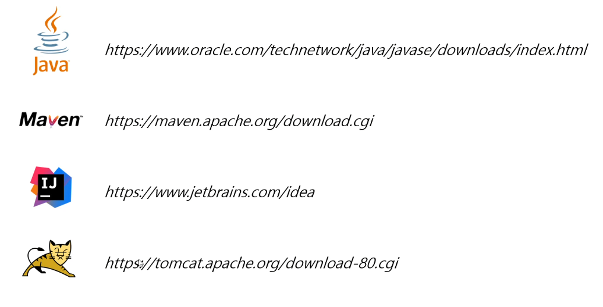

아파치 톰캣을 이용해서 서버를 개발자환경에서 배포하는것과 운영환경에서 배포하는것까지 공부를 해보겠다. 


먼저 자바 jdk를 다운로드 받아주겠다.

https://www.oracle.com/java/technologies/javase-jdk16-downloads.html 

위링크에서 자바jdk를 다운로드받을 수 있다.


다음으로는 프로젝트 관리를 위한 Maven도구를  설치

아파치 재단에서 개발한 java기반의 프로젝트 관리도구

- 프로젝트의 컴파일 빌드 수행 및 테스트

- 서버 측 Deploy자원과 라이브러리 관리

https://maven.apache.org/download.cgi

위 링크에서 zip파일을 다운로드


둘다 설치한 이후에 환경변수를 설정해주어야만한다.

지금은 계정환경변수를 설정해주겠다.

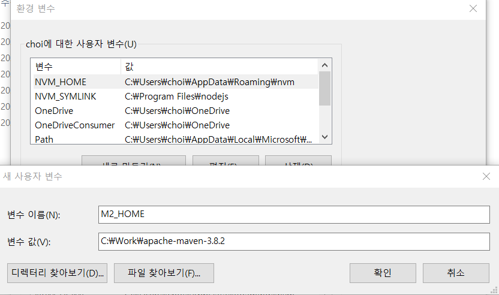


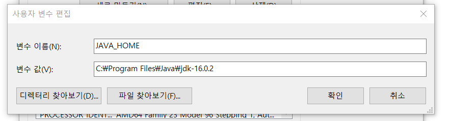


변수를 설정해주었으니 path를지정해준다. 

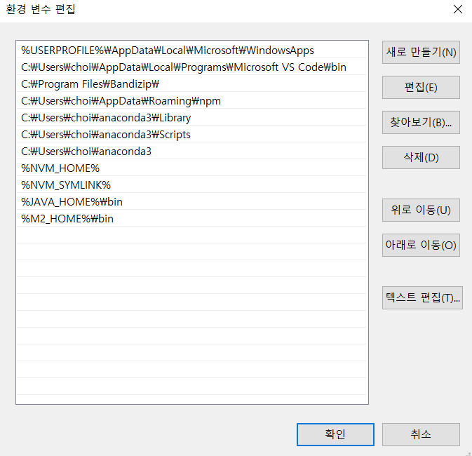


path설정이 마무리되었으면 cmd에서 확인을 해준다.

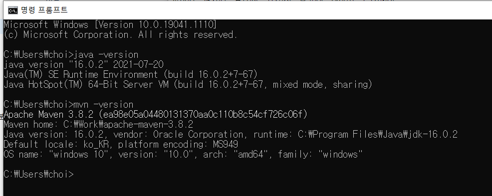


-----------

이제 통합 개발환경을 설치해보겠다.

최근에는 Intellij IDEA가 각광받는다. 다양한 편의기능이 있어서 많이 이용하고있다.

jetbrain사에서 다운로드 받을 수 있다. 

https://www.jetbrains.com/idea/download/#section=windows

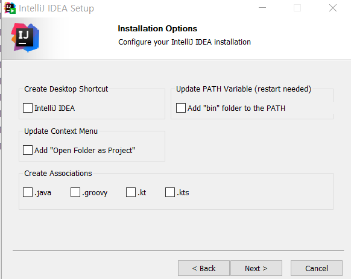

디폴트 값으로 넘어가도록 하겠다.


그다음은 톰켓서버를 다운로드 받아야한다.

https://tomcat.apache.org/download-10.cgi

톰켓서버는 윈도우 리눅스 관계없이 하나의 zip파일로 제공하기 때문에 zip을 받아서 설치해주면 된다.

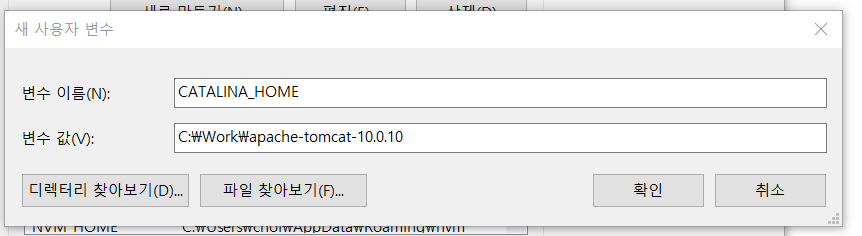

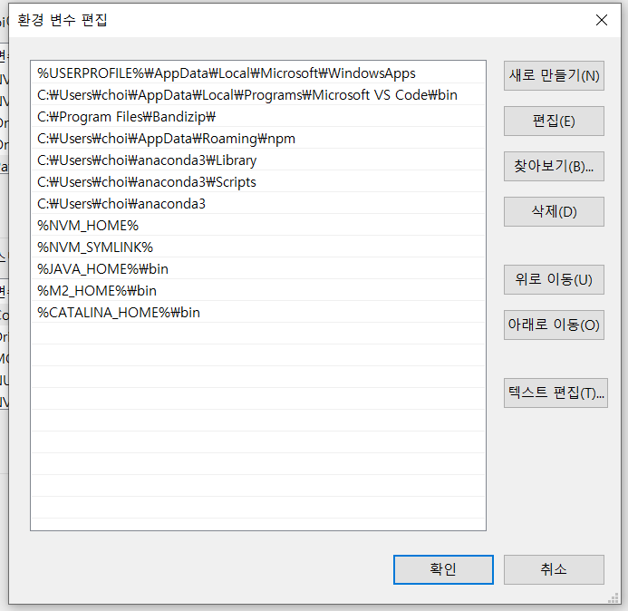

마찬가지로 환경변수 설정, path설정을 해준다.


아파치 설치 경로로 이동해보면 startup.bat와 shutdown.bat파일을 실행시켜줄 수 있다.  윈도우이기 때문에 bat으로 실행

`startup.bat` 명령어를 실행하면 tomcat서버가 실행된다. 


----------

우선 자바 개발환경인 eclipse와 intellij가 어떤 차이가 있는지 간략하게 보고가겠다.

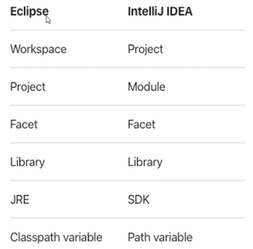

인텔리제이에서는 하나의 윈도우 안에 여러개의 프로젝트를 띄워서 사용할 수 없고 여러 프로젝트를 함께 사용하고싶다면 module이라는걸 이용해야한다.

https://www.jetbrains.com/ko-kr/idea/features/

추가적인 기능을 확인할 수 있는 링크


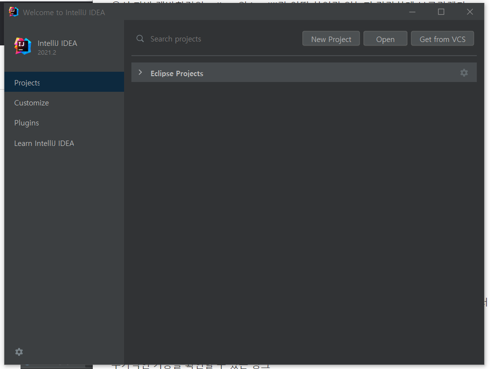

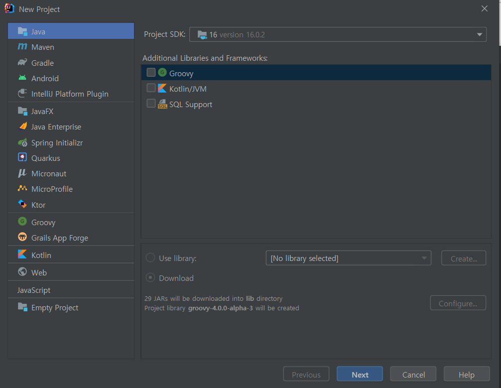


프로젝트 시작할때 템플렛 가지고 시작할건지 물어보는것인데 체크 하고 시작해봅시다

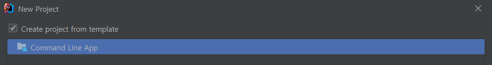


프로젝트 이름인데 예시 이름으로 시작해보겠습니다.

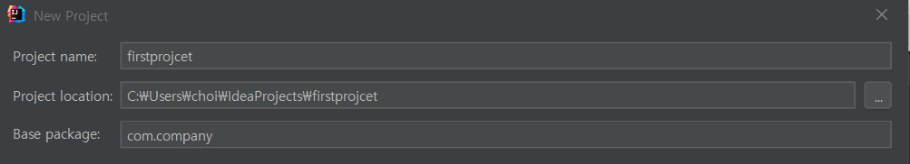


빌드/ 실행/ 디버깅 버튼이다.

컨트롤+쉬프트+F10을 누르면 RUN된다.


### settings를 통해 설정 변경

maven버전 바꾸기

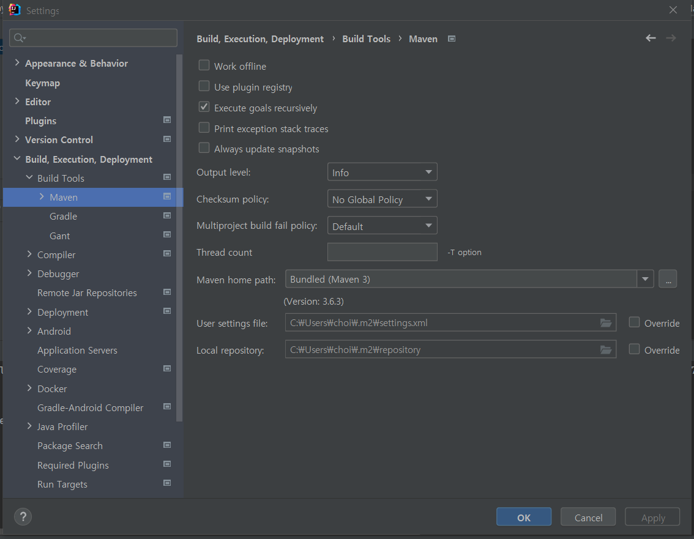

maven 홈 path를 변경해주면 버전을 바꿔줄수있다.

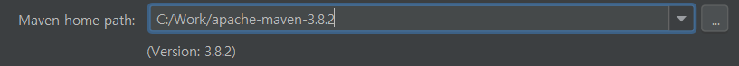

****


## Maven기반의 프로젝트 체험


만약 maven 버전이 세팅 안되어있다면 

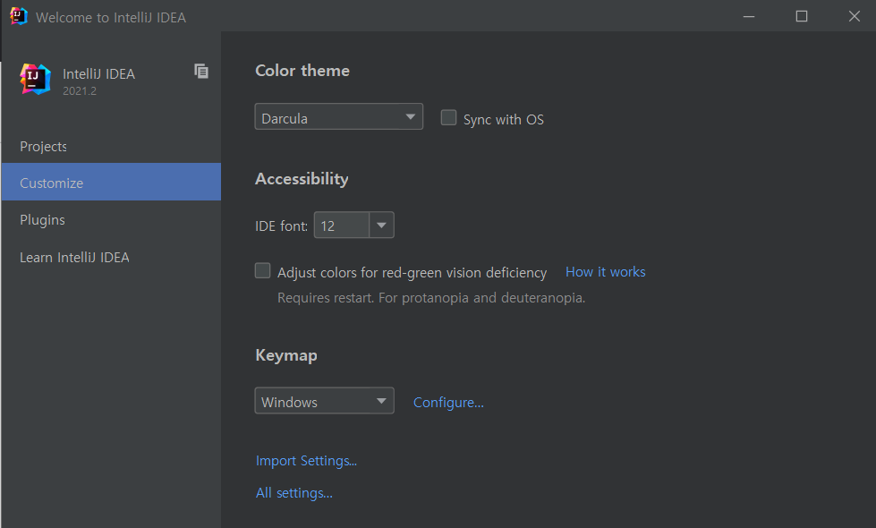

여기에서 All setting들어가고 maven버전을 바꿔준다.


자 이제 maven 프로젝트를 생성해보자.

 프로젝트 생성하고 maven생성후 archetype을 선택해준다.

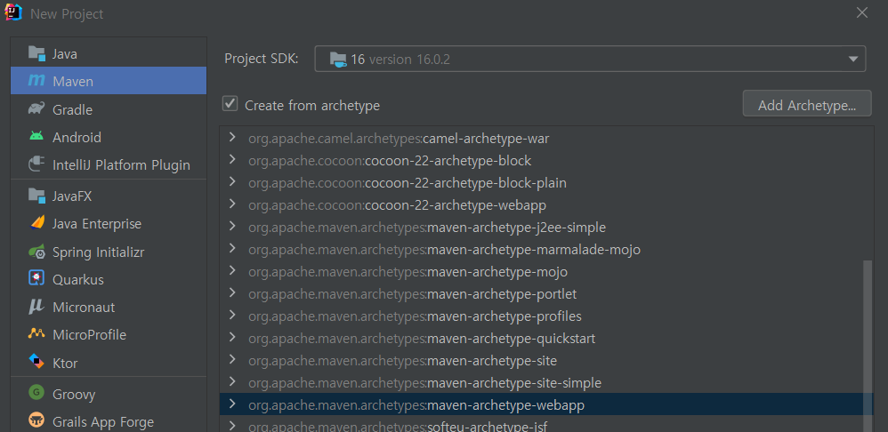


그룹아이디는 보통 어플리케이션을 개발하는 회사의 도메인주소를 쓰는게 일반적입니다.

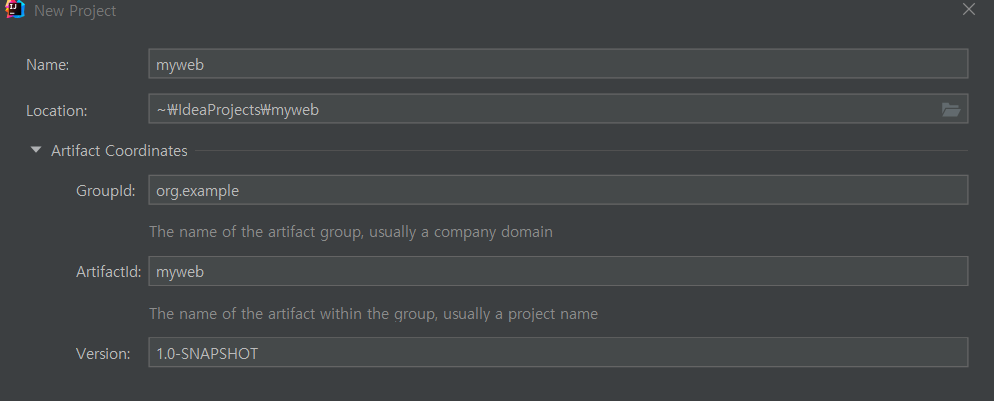


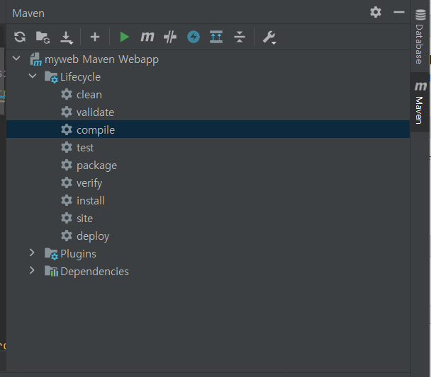

라이프 사이클의 명령어중 clean, complie, install, package 기능을 많이 사용할것이다.


maven프로젝트가 준비가 되었고

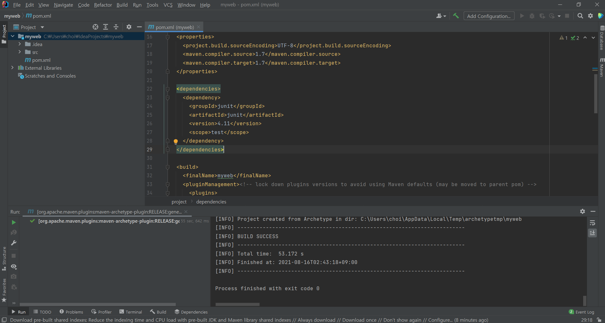

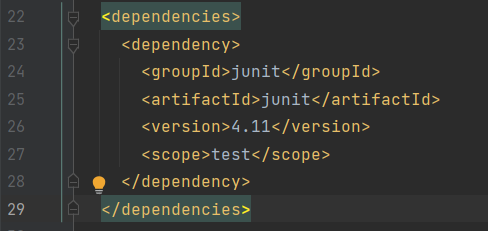

우리는 dependencies 부분을 많이 사용할것이다.

프로젝트를 개발할때 필요한 외부 라이브러리, 모듈등을 직접 다운로드 받지 않고 관리해주기 때문에 편리하게 개발에 집중할 수 있다.

기본적으로 테스트를 위한 junit이 추가되어있다.

디펜던시 추가

```
    <dependency>
      <groupId>javax.servlet</groupId>
      <artifactId>javax.servlet-api</artifactId>
      <version>4.0.1</version>
    </dependency>
```


maven프로젝트 구조

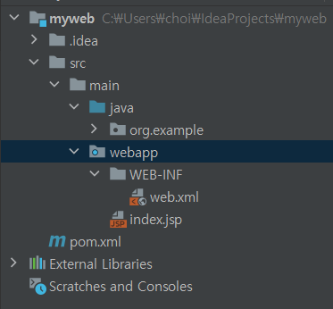

- src

  - main

    - java // 자바를 관리하기위한 디렉토리 /

    - webapp

      - web-INF

        - web.xml // 서블릿 프로젝트 환경설정파일

          //버전업이 되면서 어노테이션 방식으로 사용하도록 바뀌고있다.

      - index.jsp


```
package org.example;

import javax.servlet.ServletException;
import javax.servlet.http.HttpServlet;
import javax.servlet.http.HttpServletRequest;
import javax.servlet.http.HttpServletResponse;
import java.io.IOException;
import java.io.PrintWriter;

public class HelloServlet extends HttpServlet {
    @Override
    protected void doGet(HttpServletRequest req, HttpServletResponse resp) throws ServletException, IOException {
        resp.setContentType("text/html;charset=UTF-8");
        PrintWriter out = resp.getWriter();
        out.println(("Hello, there!!"));
        out.close();
    }
}

```


이렇게 서블릿클래스를 생성해주고나면 web.xml에 지금 만든 서블릿클래스를 이용하겠다고 등록을 시켜줘야한다. 


```
<servlet>
    <servlet-name>hello-servlet</servlet-name>
    <servlet-class>org.example.HelloServlet</servlet-class>
</servlet>
<servlet-mapping>
    <servlet-name>hello-servlet</servlet-name>
    <url-pattern>/HelloServlet</url-pattern>
</servlet-mapping>
```

이렇게 서블렛을 만들어주고 서블렛이름,  클래스를 담아준다. 

그리고 서블렛을 불러오기위한 url을 매핑시켜주기위해 서블렛 이름이 hello-servlet인 서블렛의 클래스를 /HelloServlet이라는 url로 매핑시켜주겠다고 만들어준것.

이건 좀 불편해서 어노테이션 방식을 많이 이용하기도 한다.

```
@WebServlet("/HelloServlet2")
public class HelloServlet2 extends HttpServlet {
    @Override
    protected void doGet(HttpServletRequest req, HttpServletResponse resp) throws ServletException, IOException {
        resp.setContentType("text/html;charset=UTF-8");
        PrintWriter out = resp.getWriter();
        out.println(("Hi, there!!"));
        out.close();
    }
}
```

이렇게 @WebServlet("/HelloServlet2") 어노테이션을 달아준다.

****


### IntelliJ에서 톰켓서버로 등록 후 배포하는 방법

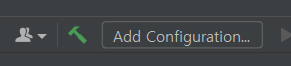

윈도우 우측 상단의 Add Configuration을 클릭

우리가 Run시킬때 어떤 프로그램을 구동할지 정할수 있다.

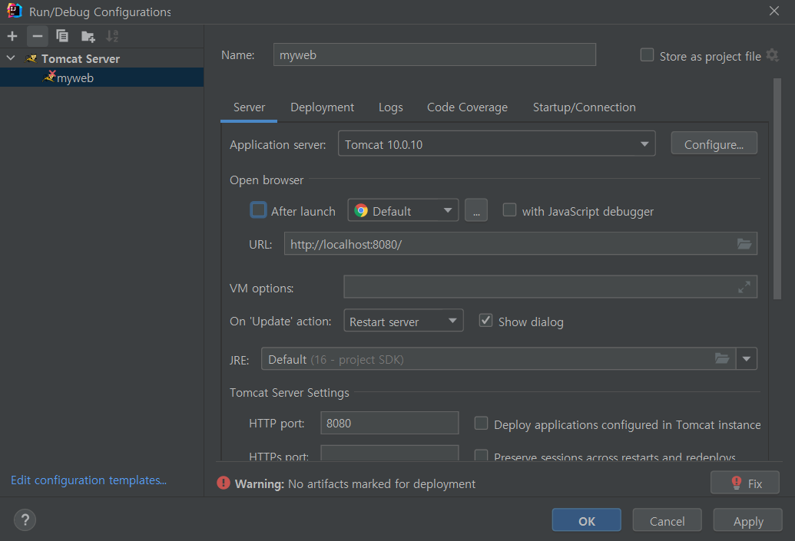

좌측 상단의 +버튼을 눌러 tomcat서버를 추가해주는데 우리는 로컬환경의 서버를 불러오기때문에 local을 선택해주고 server를 선택해주고 

만약 서버가 기동될때 웹브라우저를 띄우고싶은지는 After launch 선택 유무로 결정할 수 있다.

VM옵션은 톰켓서버를 구동함에 있어서 추가적인 자바 설정을 해줄수 있다.

지금 톰켓서버를 등록해준다고 myweb과 연결되는것은 아니다. myweb과 톰켓서버가 따로 구동되게 되는데


myweb을 톰켓서버로 배포하기위해서 필요한 작업이 남아있다.

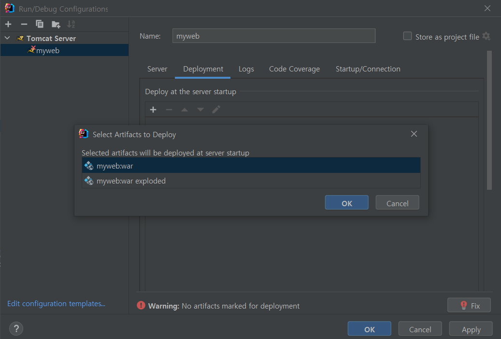

Deployment로 들어가서 +버튼을 누르면 우리가 만든 myweb이 있는데 exploded가 붙은걸 선택하면 myweb의 war파일을 압축해제해서 사용하겠다는 의미이다.

압축해제해서 배포해야하니까 exploded를 선택해준다.

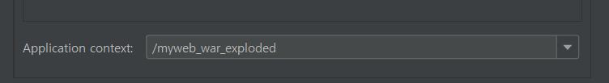

조금 아래를 보면 Application context라는게 있는데 이걸 톰켓서버의 url뒤에 붙여 접근할수있다.


이제 실행을 해보자

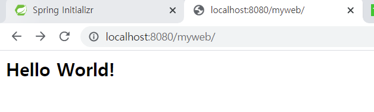

잘 나오는듯하다가

에러가 뜬다.

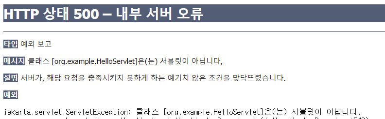


Tomcat 10.x (Servlet 5.0) 이후 `javax.*`패키지 이름이 `jakarta.*`package 로 변경되었습니다 .

디펜던시 바꿔주고

```
    <dependency>
      <groupId>jakarta.servlet</groupId>
      <artifactId>jakarta.servlet-api</artifactId>
      <version>5.0.0</version>
    </dependency>
```


코드 import 바꿔주면

```
package org.example;


import jakarta.servlet.ServletException;
import jakarta.servlet.http.HttpServlet;
import jakarta.servlet.http.HttpServletRequest;
import jakarta.servlet.http.HttpServletResponse;
import java.io.IOException;
import java.io.PrintWriter;

public class HelloServlet extends HttpServlet {
    @Override
    protected void doGet(HttpServletRequest req, HttpServletResponse resp) throws ServletException, IOException {
        resp.setContentType("text/html;charset=UTF-8");
        PrintWriter out = resp.getWriter();
        out.println("Hello, there!!");
        out.close();
    }
}
```


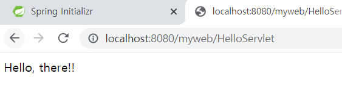

수정 후 잘 나온다.


로그에 깨지는 문자를 해결하기 위해 다음 옵션을 이용할 수도 있다.

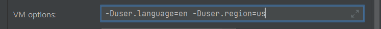

한글로 출력되는걸 막아서 한글 깨지는걸 막는다. 원인 제거 느낌?


## 앱 실시간 갱신

메이븐으로 웹앱 프로젝트를 생성하면 jsp라는 파일을 가지고 생성되는데

새로운 jsp파일을 생성해주고

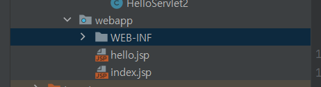

톰켓서버로 실행해주면 

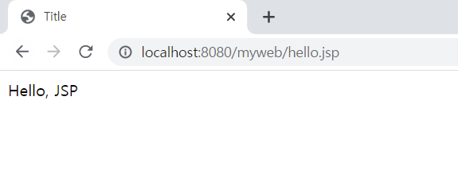

이렇게 접속할 수 있다는걸 알 수 있다. 

그리고 hello.jsp파일의 내용을 수정하고 웹페이지를 새로고침한다면?

반영되지 않는다.


이런거는 서버에 어플리케이션이 어떤방식으로 연결되었는지에 따라서 바로반영되기도하고 서버를 재구동해야하기도 한다.

지금은 war파일형태로 서버에 올려준거라 서버를 재구동해줘야한다.


 바로 반영되도록해주기 위해서는 

톰켓의 환경설정의 deployment로 들어가서 

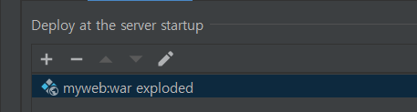

연필을 눌러줘서 수정해준다. 

target디렉토리에 있는  war파일을 서버에서 참조하는데 

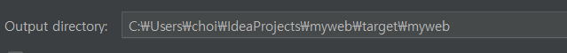

이 경로를 

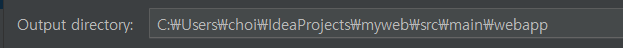

src 밑의 webapp으로( 우리가 만들던 앱)으로 설정해주면 jsp파일이 변경되는순간 업데이트가 되어서 웹브라우저에서 확인할 수 있다.

****


# 운영환경구축

개발자가 사용하는 환경, 테스터가 사용하는 환경, 운영하는환경이ㅣ 있을수 있는데

효율적인 개발을 위해서는 개발환경과 운영환경을 구분하는게 맞다.

배포 테스트

개발환경: 구현, 배포, 테스트, 형상관리

운영환경: 개발테스트 완료된 프로그램을 서비스하기위한 환경 

​				운영도구, 모니터링도구가 포함되어있어야한다.


local환경: 개발자 개인이 가지고있는환경

QA환경: 테스터들이 이용하는 환경

Stagin환경: 운영환경과 거의 동일한데 이전하기전에 비기능정 테스트를 검증하는것,

​	보안 성능같은것을 검증

productions환경: 실제 운영환경


패키지형태로 넘겨줘야하는데 다수의 패키지를 넘겨주려면 CI/CD가 가능해야한다.


지속적으로 통합하고 지속적으로 배포하는 모든것을 자동화하는게 필요하다.

자동화 하는게 매우 중요하다.

****


이제 Maven의 LifeCycle의 명령어를 실행해보면서 Maven프로젝트가 어떻게 빌드되는지 확인해보자. 

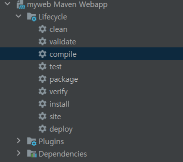

- compile

컴파일이 진행되면서 그 결과값이 프로젝트폴더 안에 target폴더가 생성되며 그 안에 패키지가 생성된다. 


- clean

존재하는 target폴더를 삭제해준다.


- package

패키징이 진ㄴ행되고

컴파일, 패키징(압축), 테스트, 지정한 폴더로 이동하는 작업까지 진행된다.

컴파일 옵션과 다른거는 war파일이 생성되며 그 war파일이 압축이 풀렸을때 나오는 형태도 함께 target폴더에 담기게된다.


이제 war파일을 복사해서 

tomcat서버가 설치된 폴더의 webapps폴더에 war파일을 넣어주겠다.

`C:\Work\apache-tomcat-10.0.10\webapps` 여기에 war파일 복사


이후 cmd에서 아파치톰켓서버의 bin폴더 내부의 start.bat을 실행해주면 서버가 구동되는데 웹브라우저로 접속을 확인해보면 잘 되는걸 확인할 수 있다.


다시 `C:\Work\apache-tomcat-10.0.10\webapps` 에 들어가보면 톰켓서버가 실행됨과 동시에 war파일이 압축해제되어 myweb 폴더가 생성된걸 확인할 수 있다.

****


## 웹 어플리케이션을 관리하기위한 tomcat 매니저

위에서는 수작업으로 패키지를 복붙해줬는데 실제로는 관리툴을 통해 배포하고 삭제하는게 더 일반적이다.


톰켓서버가 기동된 상태에서 

`http://localhost:8080/manager/html`로 접속해주면 브라우저에서 매니저프로그램을 통해 앱을 배포 삭제가 가능하다.

초기 세팅이 안되어있어서 다음과 같이 뜬다.

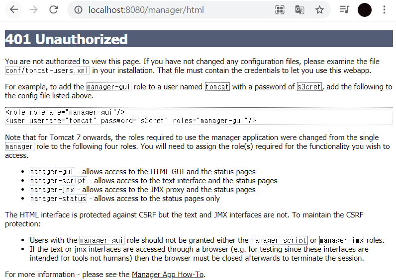


톰켓을 종료하고 `C:\Work\apache-tomcat-10.0.10\conf`폴더 안에 있는

tomcat-users.xml파일을 수정해줍니다.

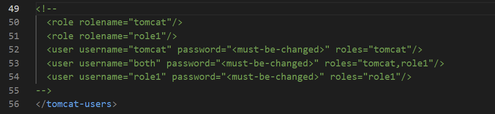

이 부분을

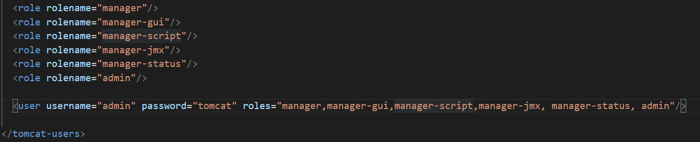

이렇게 바꿔준다.

role을 생성해주고, 

계정이름과 패스워드 설정, 그리고 그 계정에서 이용할 롤을 추가해주면된다.


다시 서버를 구동해 접속해주면

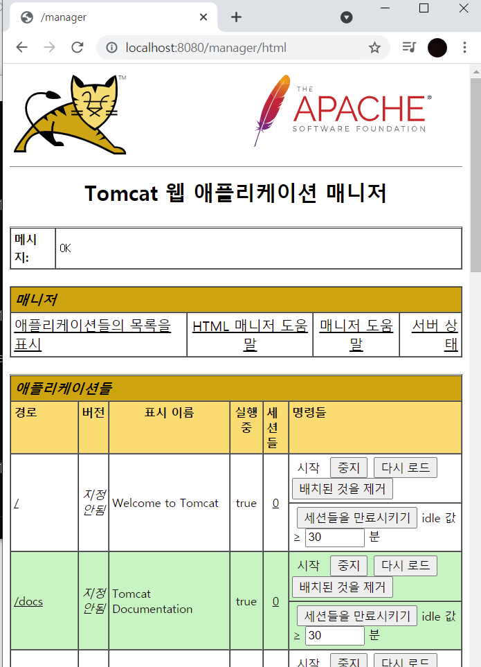

이렇게 관리 페이지에 접속할 수 있다.


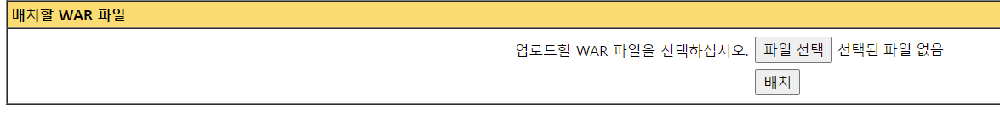

여기서 war파일을 업로드해서 앱을 배포할 수 있다

