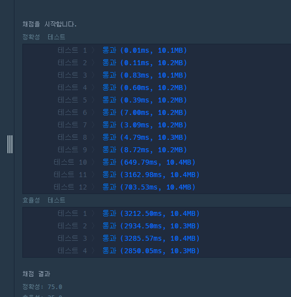
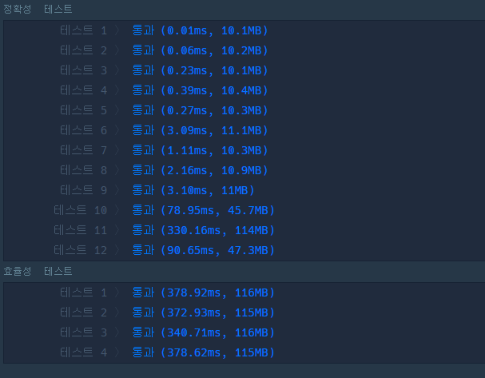

내가 짠 코드는 소수를 찾을때 제곱근까지만 검사하는 코드. 에라토스테네스 체의 역버전이라고 보면될듯. 


```
def solution(n):
    answer = 0
    for i in range(2, n+1) :
        for j in range(2, int((i**(1/2)+1))) :
            if i%j == 0 :
               # print (i, "는 소수가 아닙니다")
                answer-=1
                break
        answer+=1           

    return answer
```




에라토스테네스 체를 쓰면 

```
def solution(n):
    num=set(range(2,n+1))

    for i in range(2,n+1):
        if i in num:
            num-=set(range(2*i,n+1,i))
    return len(num)
```




시간이 거의 10배 차이남.


내가짠 코드는O(n^(3/2))  에라토스테네스는 O(n) ?? 맞는지는 모르겠는데 뇌피셜로 아무튼 이렇다.  차이가 매우 많이 남.

따라서 에라토스테네스를 활용해서 2단계의 소수찾기 문제의 효율성을 높여보자.

