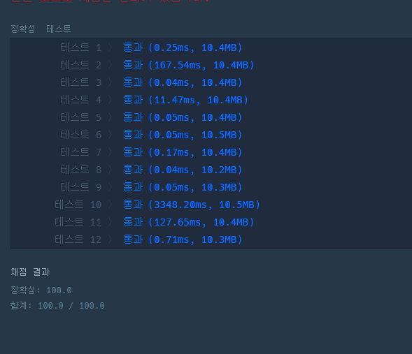
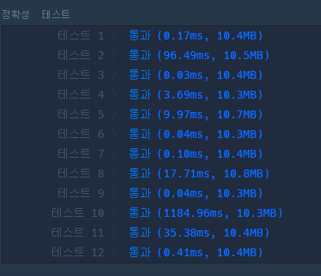
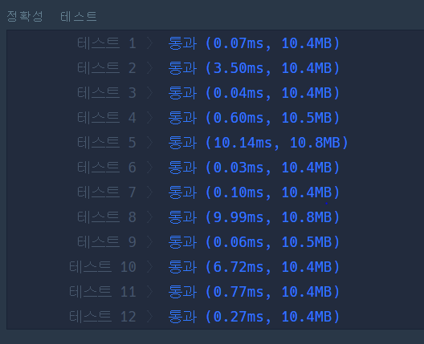
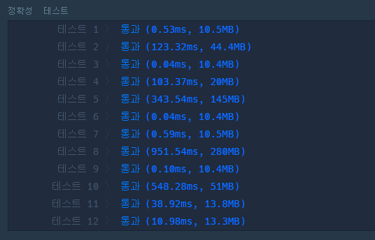

# 완전탐색 소수찾기

## 내풀이

1차 풀이




2차 풀이




3차 풀이(소수의 제곱근 이하만 검사 이용)




테스트 케이스 10의 시간이 매우 줄어든걸 확인.


## 남의 풀이

에라토스테네스 체 이용



```
from itertools import permutations
def solution(n):
    a = set()
    for i in range(len(n)):
        a |= set(map(int, map("".join, permutations(list(n), i + 1))))
    a -= set(range(0, 2))
    for i in range(2, int(max(a) ** 0.5) + 1):
        a -= set(range(i * 2, max(a) + 1, i))
    return len(a)
```

