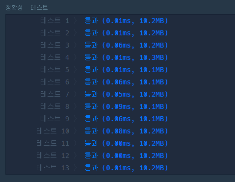
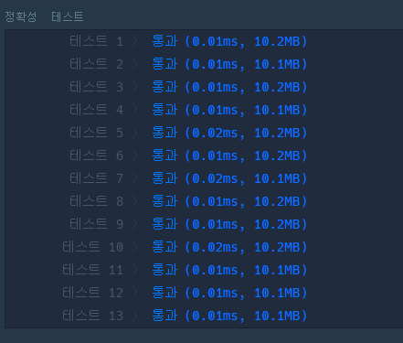

# 완전탐색 카펫

https://programmers.co.kr/learn/courses/30/lessons/42842

# 내 풀이

```
def solution(brown, yellow):
    if yellow ==1: 
        answer = [3,3]
    for i in range(1, yellow):
        if yellow%i == 0 and ((yellow/i)+2+i)*2 == brown:
            answer=[(yellow/i)+2, i+2]
            break
    return answer
```




# 남의 풀이

### 남의풀이 1

```
def solution(brown, red):
    for i in range(1, int(red**(1/2))+1):
        if red % i == 0:
            if 2*(i + red//i) == brown-4:
                return [red//i+2, i+2]
```

접근 방식은 나랑 비슷한거은데 반복문을 돌리는 과정에서 탐색 범위를 제곱근으로 한정시켜 더 효율적 

### 남의 풀이 2

```
import math
def solution(brown, yellow):
    w = ((brown+4)/2 + math.sqrt(((brown+4)/2)**2-4*(brown+yellow)))/2
    h = ((brown+4)/2 - math.sqrt(((brown+4)/2)**2-4*(brown+yellow)))/2
    return [w,h]
```

길이, 넓이 공식 각각으로 식 두개 만들고 변수 두개 존재하니까 이차방정식 -> 근의공식

