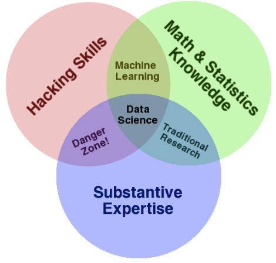

# 데이터 사이언스 개요

### 학습 목표

- 데이터 사이언스에 대한 기본 개념을 이해합니다.

### 핵심 키워드

- 데이터 사이언스 정의
- 데이터 사이언스와 통계학
- 데이터 사이언스 벤 다이어그램
- 머신러닝과 딥러닝

****

### 콘웨이의 데이터 사이언스 벤다이어그램

해킹스킬, 수학적 통계스킬, 전문적인 도메인 지식이 필요로 하다. 

이 모든 지식을 깊게 알아야지만 데이터 사이언스를 할 수 있는것은 아니다.

그러면 기본적인 데이터 사이언스 기초 지식들을 배워서 일상생활에 적용할 수 있도록 배워보겠다.

## 데이터 사이언스와 전통적 통계학

Science is NOT a battle, it is a collaboration.

데이터 과학은 경쟁이 아니라 융합이다.

- 통계학이란?

  통계학이란 산술적 방법을 기초로 다량의 데이터를 관찰하고 정리 및 ㅣ분석하는 방법을 연구하는 수학의 한 분야이다. 

통계학이 거창하다고 생각하지 말고 지식에 조금씩 살을 붙여서 활용해본다고 생각하면 좋겠다.

- 데이터 사이언스란?

  데이터 마이닝과 유사하게 정형, 비정형 형태를 포함한 다양한 데이터로부터 지식과 인사이트를 추출하는데 과학적 방법론, 프로세스 알고리즘, 시스템을 동원하는 융합 분야.

  - 정형데이터: 엑셀과같은 형태, 테이블 형태
  - 비정형형테 : 이미지, 소리와 같은 다양한 데이터

### Data Science Process

1단계 : Row Data Collected 현실 세계의 데이터 수집

2단계 : Data Is Processed 데이터 전처리

3단계: Clean Dataset

4단계: Exploratory Data Analysis 탐험적 데이터 분석

5단계 : Models & Algorithms  모델이나 알고리즘 생성

6단계 : Communicate Visualize Report  결과 분석

7단계: Data Produce 현실에 반영

### 탐색적 데이터 분석(EDA)

자료가 가지고있는 본연의 의미를 찾는데 어려움이 있어서

박스플롯을 창안했고

조금더 다양한 그래프를 이용하게되었다.

### 데이터 시각화

정보 디자인

정보 디자인은 정보를 구성하여 효율적으로사용할 수 있게하는 정보

1861년 초기 인포메이션 그래픽의 예시

기온에 따라서 돌아오는 병사에 차이가 난다. 

정보 디자인에서 

존 스노이 콜레라 지도

검정색으로 뭔가 표시가 되어있는데 영궁에서 콜레라가 발생했을때 콜레라 사망자 수를 지도에 표시한것이다. 

검은색 막대로표시해서 보니까 그 주변에 펌프가 있다 라는것을 알게되었다.

이를 통해 물을 통해 콜레라가 전파된다는걸 밝혀낸 유명한 사례가 있다. 

나이팅게일과 로즈 다이어그램

크림 전쟁에서 경험을 바탕으로 병원 위생으로 인해 사망했음을 알게되었다. 

고위 공무원에게 병원 위ㅐㅇ의 개선을 설득하기 위해 데이터를 그래프 형태로 나타내었다. 

데이터를 분석하면서 인사이트를 얻을 수 있다.

백신 접종 현황

사망률이 낮아졌다.

데이터를 통해서 직접 확인을 해볼 수 있다. 

데이터와 인공지능

어떤 관계가 있는지 알아보도록 하자. 

## 인공지능 vs 머신러닝 vs 딥러닝

계산 속도가 빨라지며 데이터 양이 방대해지면서 머신러닝과 딥러닝이 등장하게되었다. 

어떤 결과를 얻게되는지

### garbage in garbage out

어떤 데이터를 어떻게 넣어주냐에 따라 결과가 달라지게 됩니다. 

