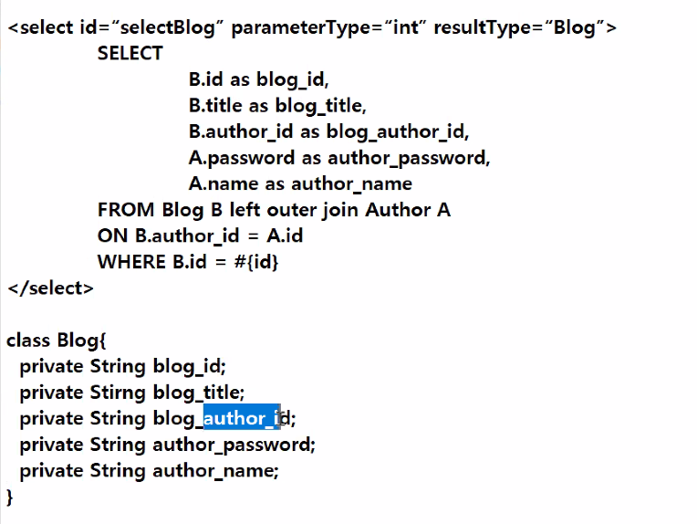
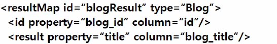
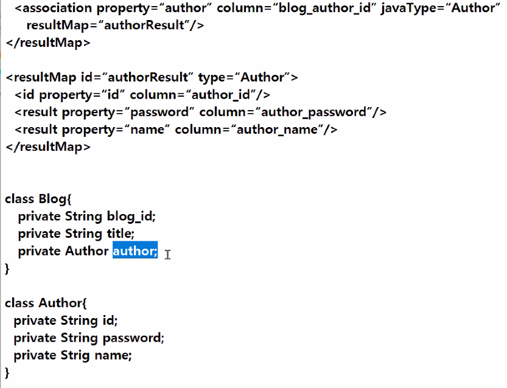
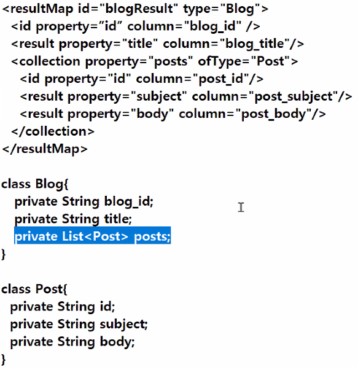

resultMap

서로 이름이 틀릴때 매핑해주는 방식

\<resultMap>

이름이 틀리다면 일일히 매칭을 시켜준다.

그리고 resultMap이름을 적어줘서 매핑시켜준다.

근데 이것도 좀 불편해서 다음과 같은 방식을 좀더 많이 쓴다.


```
<select id ="">
SELECT
	B.id as blog_id,
	B.title as blog_title,
	B.autor_id as blog_author_id,
FROM blog B left outer join Author A on B
```

이런식으로 as를 써서 변수명을 일치 시켜줘서 매핑 시켜주는것을 더 많이 쓴다.


정리해보면 다음과 같이 두개의 방법을 쓴다. 

1. resultMap

```
<resultMap id="">
	<result property="변수명" column="컬럼명">
```


2.sql as이용

```
select
	board_seq as seq,
```


글수정

글 수정 버튼 클릭

- updateForm.jsp이동
- 해당 글번호에 대한 DB에서 한개의 글을 가져오기
- 수정폼에서 출력
- 수정완료
- 전달된 데이터
- 마이베티스 => update실행
- <update, updateBoard(), DAO메서드 호출


글삭제

- delete.jsp => DAO호출 deleteBoard() => 삭제 처리
- Redirect => list.jsp

if(re>0){
		response.sendRedirect("list.jsp");
	}





- 연관되어있는 경우 매핑

  



이렇게 블로그에 author가 연관되어있을때 

매핑을 해주고 거기에다가 추가로 author를 분리해서 매핑시켜줘야한다. 


- \<association>대신 \<collection>이라는 태그를 이용해서 결과값 다발을 가져올 수 있다.




테이블 생성한다

```
create table blog(
  id varchar2(50),
  title varchar2(50),
  content varchar2(50),
  author_id varchar2(50)
)

create table author(
  author_id varchar2(50),
  name varchar2(50),
  address varchar2(50)
)

alter table author
	add constraint author_author_id_pk primary key(author_id)

alter table blog
	add constraint blog_id_pk primary key(id)

alter table blog
	add constraint blog_author_id_fk
	foreign key(author_id)
	references author(author_id)

```


데이터 넣기

```
insert into author values('100','홍길동','강남')
insert into author values('200','박길동','가산')
insert into author values('300','김길동','홍대')
commit;
```

```
insert into blog values('1','aa','aa','200');
insert into blog values('2','bb','bb','100');
commit;
```

