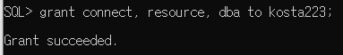

# 데이터베이스

대량의 데이터베이스를 체계적으로 저장, 관리하기 위해 Database 등장

학사관리 정보 도서관리 정보, 인사관리 정보 등

서로 연관성을 가지며, 중복없이 지속성으로 유지 관리해야할 유용한 데이터들의 집합을  Database라고 한다. 


SQL - 기본쿼리, 연산자, 함수, 조인, 서브쿼리, 제약조건, 뷰

PL/SQL - 프로시저, 패키지

DB구축 - DB모델링


오라클 db 설치

### **세팅**

cmd에 입력

`sqlplus/nolog`

`conn sys as sysdba`


### 계정생성

`create user kosta223 identified by 1234;`


### 계정에 권한 주기

`grant connect, resource, dba to kosta223`




강사가 준 sql 파일을 가지고 연습을 해볼것이다.

oracle_exam2.sql 불러오기

sql파일을 로드하는법 =>` @파일경로`

cmd에서 코드가 엄청 실행되면서 

계정에 sql이 실행된다. 

목록들을 확인하고 싶으면

`select * from tab;`


### hr계정 unlock 해준다.

- HR계정이란 오라클에서 기본적으로 제공해주는 학습용 계정인데. HR계정말고도 여러개있습니다. 하지만 이 HR계정은 기본적으로 잠겨있어서 HR계정을 사용하기 위해서는 계정을 Unlock시켜주는 작업을 진행해야 합니다.

먼저 시스템 계정으로 들어가야함

`conn /as sysdba`

언락을 위한 명령어를 넣어준닫

`alter user hr identified by hr account unlock`


계정 확인을 해본다 hr에 접속

`conn hr/hr`

`select * from tab;`을 쳐보면 테이블이 잘 나온다고 보면된다. 


### scott계정 불러오기

scott계정이란?

**scott** : 처음 오라클을 사용하는 사용자를 위해 만들어놓은 사용자명이다.

`conn system/1234`

그리고 이걸 불러온다.

`@C:\oraclexe\app\oracle\product\11.2.0\server\rdbms\admin\scott.sql`

패스워드 바꿔주기

'alter user scott identified by tiger'


오라클 sql developer로 접속해보자


scott 비밀번호는 tiger


kosta223 계정에 데이터가 안들어가는 문제가 있어서 다시 @파일경로 로 데이터를 삽입하고

`commit;`명령어을 통해 커밋해줬다.


### 테이블 목록 불러오기

-> SELECT * FROM tab;


테이블 구조 불러오기

-> DESC 테이블명


### SELECT 질의 구조

SELECT 컬럼들  FROM 테이블명

SELECT * FROM employees;

SELECT employee_id, last_name FROM employees;


별칭 AS, ""

-> SELECT employee_id AS 사원번호, last_name "사원이름" FROM employees;


### 중복된 데이터 제거

이렇게만 하면 중복된 데이터가 나온다.

-> SELECT job_id FROM employees;


중복된 데이터를 제거하려면 DISTINCT를 넣는다.

-> SELECT DISTINCT job_id FROM employees;


### 예제

1. 각 학생의 평점을 검색하라(학번, 이름 학점): student ->별칭 사용

   ```
   SELECT sno AS 학번,sname AS 이름 ,avr AS 학점 FROM student;
   ```

   

2. 각 과목의 학점을 검색하라.(과목번호, 과목명, 학점수): course -> 별칭

   SELECT cno AS 과목번호, cname AS 과목명, st_num AS 학점수 FROM course;

   

3. 각 교수의 직위를 검색하라.(교수번호, 교수이름, 직위): professor -> 별칭

   SELECT pno AS 교수번호, pname AS 이름, orders AS 직위 FROM professor;

   

4. 급여를 10% 인상했을 때 각 직원마다 연간 지급되는 급여를 검색하라.: emp (사원번호, 사원이름, 연봉) -> 별칭

   SELECT eno AS 사원번호, ename AS 사원이름, sal\*12*1.1 AS 연봉 FROM emp;

   

5. 현재 학생의 평점은 4.0만점이다. 이를 4.5만점으로 환산해서 검색하라.: student(학번, 이름, 환산학점)

   SELECT sno AS 학번,sname AS 이름, avr*4.5/4.0 AS 학점 FROM student;


### 정렬 묶음 검색(ORDER BY절)

ORDER BY \[컬럼명]\[인덱스][옵션{DESC}]


이렇게만 하면 그냥 출력되지만

-> SELECT eno, ename, sal FROM emp;


아래처럼 ORDER BY sal DESC를 하면 sal을 기준으로 내림차순으로 정렬된다. 

->SELECT eno, ename, sal FROM emp ORDER BY sal DESC;

DESC를 안넣으면 기본값으로 오름차순으로 정렬된다. 


### 퀴즈

kosta223에서 진행

각 학과별로 교수의 정보를 부임일자 순으로 검색하라. 

학과별로 정렬, 부임일자순으로 정렬

-> SELECT pno, pname, section, hiredate FROM professor ORDER BY section, hiredate;

이렇게 하면 먼저 section별로 정렬이 이루어지고 그 다음 hiredate를 기준으로 정렬이 된다.


### 조건에 맞는 일부 데이터 불러오기 (WHERE절)

-> SELECT employment_id, last_name, hire_date FROM employees WHERE last_name = 'King';

이렇게 하면 last_name이 King인 사람만 검색이 된다. 

-> SELECT employment_id, last_name, hire_date FROM employees 

​		WHERE hire_date >= '03/01/01';

입사일이 03/01/01 이후인사람만 검색


## 연산자

#### AND연산자

연봉 5000~10000 사이의 직원들 내역을 출력하라

-> SELECT employee_id, last_name, salary FROM employees 

​		WHERE salary >=5000 AND salary <= 10000;


#### BETWEEN AND 연산자

-> SELECT employee_id, last_name, salary

​	FROM employees

​	WHERE salary BETWEEN 5000 AND 10000;


#### OR 연산자

-> SELECT employee_id, last_name, job_jd

​	FROM employees

​	WHERE job_id = 'FI_MGR' OR job_id = 'FI_ACCOUNT';


#### IN 연산자

-> SELECT employee_id, last_name, job_i

​	FROM employees

​	WHERE job_id IN('FI_MGR','FI_ACCOUNT');


예제

- 2, 3학년 학생 중에서 학점이 2.0에서 3.0사이의 학생을 검색하라

  SELECT * FROM STUDENT 

  WHERE syear IN(2,3) AND AVR BETWEEN 2.0 AND 3.0;

  

- 화학, 물리학과 학생중에 1,2학년 학생을 성적순으로 검색하다.

  SELECT * FROM STUDENT 

  WHERE Major = '물리' OR major = '화학' AND syear IN(1,2) 

  ORDER BY avr DESC;

  

- 화학과 정교수를 검색하라

  SELECT * FROM professor 

  WHERE orders = '정교수' AND section = '화학';


#### NOT 연산자

 -> SELECT department_id, department_name

​	FROM departments

​	WHERE NOT department_id = 10;

이렇게 표기할 수도 있다.

​	WHERE department_id ^= 10

​	WHERE department_id <> 10


#### IS NOT NULL 연산자 (NULL이 아닌것만 탐색)

-> SELECT employee_id, last_name, commisstion_pct

​	FROM employees

​	WHERE commission_pct IS NOT NULL;


#### LIKE 연산자 

비슷한 문자열을 찾아주는 연산자

'김%' => '김'으로 시작하는 모든 문자열 예) 김길동, 김박사, 김밥

'%과' => '과'로 끝나는 모든 문자열 예)화학과, 인사과

'%김%' => '김'이라는 문자를 포함하는 모든 문자열 예)김씨, 돌김, 참치김밥

'화_' => '화'로 시작하는 2글자 문자열 예) 화약, 화학

'\_등_' => '등'이 가운데 들어간 3글자 문자열  예)고등어, 꽃등심, 삼등분


-07년도 입사한 사원의 목록 출력하라.

-> SELECT employee_id, last_name, hire_date

​	FROM employees

​	WHERE hire_date BETWEEN '07/01/01'

​	AND '07/12/31'

이렇게 해줄수도 있는데

LIKE연산자를 이용한다면

--> SELECT employee_id, last_name, hire_date

​	FROM employees

​	WHERE hire_date LIKE '07%';

이렇게 할 수 있다.


퀴즈 hr>last_name에 'a'가 들어가지 않는 사원을 출력하라.

SELECT * FROM EMPLOYEES WHERE last_name NOT LIKE '%a%';


예제

- 화학과 학생 중에 성이  '관'씨인 학생을 검색하라

  SELECT * FROM STUDENT WHERE major='화학' AND SNAME LIKE '관%';

- 부임일이 1995년 이정의 정교수를 검색하라

  SELECT * FROM PROFESSOR WHERE HIREDATE <='95/01/01' AND ORDERS='정교수';

- 성과 이름이 각각 1글자인 교수를 검색하라.(이름이 2자)

  SELECT * FROM PROFESSOR WHERE PNAME LIKE '__';

- 화학과 학생 중에 4.5환산 학점이 3.5이상인 학생을 검색하라

  SELECT * FROM STUDENT WHERE MAJOR='화학' AND AVR*4.5/4.0 >= 3.5;

- 화학과 이외 학과 학생의 평점을 각 학과별 그리고 학년별 순서로 출력하라

  SELECT * FROM STUDENT WHERE NOT MAJOR='화학' ORDER BY MAJOR,AVR DESC ;


#### 집합

UNION : 결과값을 합집합으로 묶음, 결과 값의 중복은 제거

UNIONALL : 결과값을 합집합으로 묶음, 결과 값의 중복 허용

MINUS : 결과값을 차집합으로 묶음

INTERSECT : 결과값을 교집합으로 묶음


주의> 열(컬럼)의 개수와 자료형이 일치


이렇게 두 SELECT문으로 만든 테이블을 UNION으로 합쳐서 출력할 수 있다.

SELECT eno, ename, dno

FROM emp

WHERE dno = 10 

UNION

SELECT eno,ename, dno

FROM emp

WHERE dno = 20


퀴즈) 집합연산자를 이용하여 emp 내용 중 10번 부서번호를 제외한 내용을 출력하라

SELECT eno, ename, dno FROM emp
MINUS
SELECT eno,ename, dno FROM emp WHERE dno = 10;


\<mission scoot>

- emp 테이블을 사용하여 20번, 30번 부서에 근무하고 있는 사원 중 급여(sal)가 2000초과인 사원을 다음 두가지 방식의 SELECT문을 사용하여 사원번호, 급여, 부서번호를 출력하라.

  

1) 집합연산자를 사용하지 않은 방식

​	SELECT eno, ename, dno, SAL FROM emp WHERE dno in(20,30) AND sal>2000;


2) 집합연산자를 사용한 방식

​	SELECT eno, ename, dno, SAL FROM emp WHERE dno=20 AND sal>2000
​	UNION
​	SELECT eno, ename, dno, SAL FROM emp WHERE dno=30 AND sal>2000;


#### 그룹함수

sum(), avg(), max(), count()

SELECT sum(salary) FROM employees; //전체 총합

SELECT count(*) FROM employees; //전체 요소 수

SELECT avg(salary) FROM employees; // 전체 평균


#### GROUP BY절

중요 주의사항: 컬럼내역은 그룹함수 또는 GROUP BY절 사용한 컬럼

부서별 평균급여를 검색하라.

-> SELECT department_id, avg(salary) 

​					FROM employees 

​					GROUP BY department_id


이렇게 GROUP BY에서 사용한 컬럼이나 그룹함수를 사용한 속성만 표시할 수 있고

만약에 

-> SELECT department_id, avg(salary), last_name  /////// 이렇게 그룹화되지 않은 속성

​					FROM employees 

​					GROUP BY department_id

그룹화되지 않은 속성을 출력하려고 하면 오류가 발생한다.


퀴즈) 부서별로 사원의 수와 커미션을 받는 사원의 수를 검색하라.

```
SELECT DEPARTMENT_ID,count(*), count(COMMISSION_PCT) 

FROM EMPLOYEES 

GROUP BY DEPARTMENT_ID;
```


강사풀이

```
SELECT department_id, count(*), count(commission_pct)
FROM employees
GROUP BY department_id
ORDER BY departMENT_Id
```


예제)

- 화학과 학년별 평균 학점을 검색하라

  ```
  SELECT SYEAR,major,avg(avr) FROM STUDENT WHERE MAJOR='화학' GROUP BY major,SYEAR ORDER BY SYEAR;
  ```

- 각 학과별 학생수를 검색하라

  ```
  SELECT major, count(*) FROM STUDENT GROUP BY MAJOR;
  ```

  

- 화학과 생물학과 학생을 4.5환산 학점의 평균을 각각 검색하라
	```
  SELECT major, avg(avr*4.5/4.0) 
  FROM STUDENT 
  WHERE major in('화학','생물') 
  GROUP BY major;
	```


#### HAVING절

전체그룹에서 일부그룹만 추출하기 위해 

부서별 급여 평균이 5000 미만의 부서의 부서번호와 평균급여를 검색하라.

GROUP  BY절의 조건절이라고 생각해도 된다.

```
SELECT department_id, AVG(salary) 
FROM employees 
GROUP BY department_id
HAVING AVG(salary) < 5000;
```


예제)

- 화학과를 제외한 학생들의 과별 평점평균을 검색하라

  ```
  SELECT major, ROUND(avg(avr),2) //소수점 2자리까지 반올림 
  FROM STUDENT 
  GROUP BY major 
  HAVING major !='화학';
  ```

  

  

- 화학과를 제외한 각 학과별 평점 중에 평점이 2.0이상 학과정보를 검색하라

  ```
  SELECT major, avg(avr) 
  FROM STUDENT 
  GROUP BY major 
  HAVING major !='화학' 
  AND avg(avr)>=2.0;
  ```

  

- 근무중인 직원 3명 이상인 부서를 검색하라

  ```
  SELECT DNO, count(\*) 
  FROM EMP 
  GROUP BY DNO 
  HAVING count(*)>=3;
  ```

  

