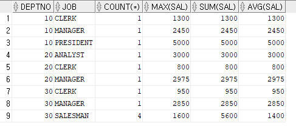
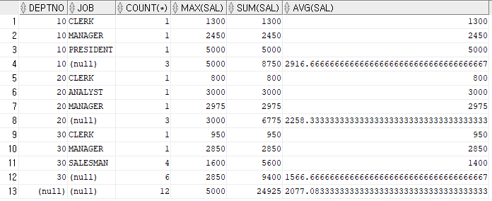

### 문자함수

#### LOWER()-> 소문자로 변환

-> SELECT 'DataBASE', LOWER('DataBase') FROM dual;


#### UPPER() -> 대문자로 변환


#### SUBSTR() -> 부분문자열 추출

-> SELECT SUBSTR('abcdef', 2, 4) FROM dual;  // 인덱스가 0이 아니라 1부터 시작

​															// b부터, 4개의 문자 출력

-> SELECT SUBSTR('abcdef', 4) FROM dual;  //인덱스 4부터 마지막까지 출력


퀴즈) emp 테이블 job컬럼 문자열 중 문자열 첫번쨰부터 2문자, 3번째부터 2문자, 5번째 이후문자 출력

```
SELECT job, SUBSTR(job,1,2), SUBSTR(job,3,2), SUBSTR(job,5) FROM emp;
```


필요에 따라서는 인덱스를 뒤에서부터 선택할 수 있다.

-> SELECT job, SUBSTR(job, -LENGTH(job)) FROM emp;

-> SELECT job, SUBSTR(job -3) FROM emp; // 뒤에서 3번쨰문자부터 마지막까지 출력

출력예시 : CLERK	ERK


#### LENGTH() -> 문자열 길이

#### LPAD(), RPAD() -> 데이터 빈 공간을 특정 문자로 채우는 것

-> SELECT 'Oracle', LPAD('Oracle', 10, '#'), RPAD('Oracle', 10, '*') 

​	FROM dual;

// 전체 10칸중에 빈공간을 왼쪽 또는 오른쪽으로 채워줌

출력예시: Oracle	####Oracle	Oracle\****


퀴즈 kosta223> 과목명 마지막 글자를 제외하고 출력하라.(course)

```
SELECT CNAME, SUBSTR(CNAME,1,LENGTH(CNAME)-1) FROM COURSE;
```


#### 숫자함수

#### MOD -> 나머지값 리턴

-> SELECT MOD(10, 3) FROM dual;


#### ROUND -> 반올림값 리턴

-> SELECT ROUND(23.432432, 2) FROM dual; //23.432432 의 소수 2번째 자리를 반올림

출력예시) 23.43

 ROUND(23,432432, 1) 일때는 23.4

ROUND(23,432432, 0) 일때는 23

ROUND(23,432432, -1) 일때는 20


### 날짜함수

#### SYSDATE => 현재시간을 출력하는 함수

-> SELECT SYSDATE -1 "어제", SYSDATE "오늘", SYSDATE + 1 "내일" FROM dual;


퀴즈 hr) 사원의 근속년을 출력하라. ex(10.5)

```
SELECT HIRE_DATE, ROUND((SYSDATE-HIRE_DATE)/365,1) FROM EMPLOYEES;
```


#### ADD_MONTHS(날짜데이터, 더할 개월 수)

-> SELECT SYSDATE, ADD_MONTHS(SYSDATE, 1) FROM dual;

// 출력예시 : 21/08/20	21/09/20

#### NEXT_DAY(날짜데이터, 요일문자)

-> SELECT SYSDATE, NEXT_DAY(SYSDATE, '월요일') FROM dual;

// 출력예시 : 21/08/20	21/08/23   // 다음 월요일


### 변환함수

#### TO_CHAR(): 숫자, 날짜 => 문자열 변환

-> SELECT TO_CHAR(SYSDATE, 'YYYY-MM-DD'), TO_CHAR(50000000, '$999,999') FROM dual;

출력 예시 : 2021-08-20	  $50,000,000


#### TO_DATE(): 문자열 => 날짜데이터 변환

-> SELECT TO_DATE('2021-08-20', 'YYYY-MM-DD'), TO_DATE('20210821','YYYY-MM-DD') FROM dual;

출력예시: 21/08/20	21/08/21


퀴즈) hr) 2007년도에 입사한 사원의 목록을 출력하라 . TO_CHAR()사용

```
SELECT * FROM EMPLOYEES WHERE TO_CHAR(HIRE_DATE,'YYYY')='2007';
```


#### NVL(): NULL을 0또는 다른 디폴트값으로 변환

-> SELECT employee_id, salary, NVL(commission_pct, 0)

​			FROM employees;


#### NVL2(expr1, exper2, exper3) 

#### : exper1값이 NULL이면 exper2반환, 아닌경우 exper3으로 반환


#### DECODE 함수

-> SELECT job_id, DECODE(job_id, 'SA_MAN','Sales Dept', 'SH_CLERK','Sales Dept','Another') FROM employees;

???? 뭔소리야 ;;


#### CASE WHEN

-> SELECT job_id,

​	CASE job_id

​	WHEN 'SA_MAN' THEN 'Sales Dept'

​	WHEN 'SH_CLERK' THEN 'Sales Dept'

​	ELSE 'Anther2'

​	END "CASE"

​	FROM employees;

이렇게 두가지 경우가 있는거같다 속성에서 빼오면서 비교

그냥 바로 비교

->SELECT EMPNO, MGR, 
CASE
WHEN MGR IS NULL THEN '0000'
WHEN SUBSTR(MGR, 1, 2)='78' THEN '8888'
WHEN SUBSTR(MGR, 1, 2)='77' THEN '7777'
WHEN SUBSTR(MGR, 1, 2)='76' THEN '6666'
WHEN SUBSTR(MGR, 1, 2)='75' THEN '5555'
ELSE TO_CHAR(MGR)
END AS CHG_MGR 
FROM emp;


#### ROLLUP함수 - 각 그룹별 총계를 구하는 함수

-> SELECT deptno, job, COUNT(*), MAX(sal), SUM(sal), AVG(sal) FROM emp

FROM emp

GROUP BY deptno, job

ORDER BY deptno, job;



-> SELECT deptno, job, COUNT(*), MAX(sal), SUM(sal), AVG(sal) FROM emp

GROUP BY ROLLUP(deptno, job);




예제)

1번

```
SELECT EMPNO, 
RPAD(SUBSTR(EMPNO,1,2),4,'*') AS MASKING_EMPNO, ENAME, 
RPAD(SUBSTR(ENAME,1,1),5,'*') AS MASKING_ENAME 
FROM emp WHERE LENGTH(ENAME)=5 ;
```

2번

```
SELECT EMPNO, ENAME,SAL, 
TRUNC(SAL/21.5,2) AS DAY_PAY, 
ROUND(SAL/21.5/8,1) AS TIME_PAY 
FROM emp;
```

- TRUNC() : 버림함수

3번

```
SELECT EMPNO, HIREDATE, 
NEXT_DAY(ADD_MONTHS(HIREDATE,3),'월요일') AS R_JOB,
NVL(TO_CHAR(COMM),'N/A') AS COMM
FROM emp;
```

4번

```
SELECT EMPNO, MGR, 
CASE
WHEN MGR IS NULL THEN '0000'
WHEN SUBSTR(MGR, 1, 2)='78' THEN '8888'
WHEN SUBSTR(MGR, 1, 2)='77' THEN '7777'
WHEN SUBSTR(MGR, 1, 2)='76' THEN '6666'
WHEN SUBSTR(MGR, 1, 2)='75' THEN '5555'
ELSE TO_CHAR(MGR)
END AS CHG_MGR 
FROM emp;
```


****

예제2)

 1번 

```
SELECT DEPTNO, TRUNC(SUM(sal)/COUNT(sal),0) AS AVG_SAL, MAX(sal) AS MAX_SAL, MIN(sal) AS MINSA, COUNT(*) 
FROM emp GROUP BY DEPTNO;
```

2번

```
SELECT JOB, COUNT(*) FROM emp GROUP BY JOB HAVING COUNT(*)>=3;
```

3번

```
SELECT TO_CHAR(HIREDATE,'YYYY') AS HIRE_YEAR , DEPTNO , count(*) AS CNT 
FROM  emp 
GROUP BY TO_CHAR(HIREDATE,'YYYY'), DEPTNO;
```

4번

```
SELECT NVL2(COMM,'O','X') AS EXIST_COMM, COUNT(*) AS CNT FROM  emp GROUP BY NVL2(COMM,'O','X');
```

5번 

```
SELECT DEPTNO, NVL(TO_CHAR(HIREDATE,'YYYY'),' ') AS HIRE_YEAR, COUNT(*),  MAX(sal) AS MAX_SAL, SUM(sal) AS SUM_SAL, TRUNC(SUM(sal)/COUNT(sal),0) AS AVG_SAL
FROM emp GROUP BY ROLLUP(DEPTNO, TO_CHAR(HIREDATE,'YYYY')) ;
```


# DDL

### 테이블 생성

CREATE TABLE 테이블명(

컬럼명1 데이터형, 

컬럼명2 데이터형

)


### 데이터형(자료형)

문자형: CHAR(size), VARCHAR2(size)

varchar2는 가변형

숫자형: NUMBER

날짜형: DATE, TIMESTAMP

대용량: LOB, BLOB


### 테이블 복사

CREATE TABLE emp01

AS SELECT * FROM employees; // 기존 테이블의 데이터가 모두 포함


### 테이블 구조 복사

CREATE TABLE emp01

AS SELECT * FROM employees

WHERE 1=0;


### 테이블 구조 수정

#### 컬럼추가

ALTER TABLE emp02

ADD(job VARCHAR2(50));


#### 컬럼수정

ALTER TABLE emp02

MODIFY(job VARCHAR2(100));


#### 컬럼삭제

ALTER TABLE emp02

DROP COLUMN job;


### 테이블 데이터 삭제

#### TRUNCATE TABLE

TRUNCATE TABLE emp01; //기본적으로DDL이기 때문에 트랜잭션 적용 불가능


#### DELETE FROM

DELETE FROM emp01; // DML(트랜잭션 적용 가능) 다시 돌려올 수 있다.


## DML (INSERT, UPDATE, DELETE)


테스트를 위해 사전에 dept01을 만들어줬다.

```
CREATE TABLE dept01

AS SELECT * FROM departments;
```

### INSERT INTO

```
INSERT INTO dept01 VALUES(300,'Developer', 100, 10);
```

만약 컬럼 일부만 넣겠다면?

```
INSERT INTO dept01 (department_id, department_name) VALUES(400,'Developer2');
```

위처럼 넣어줄 속성을 명시해줘야한다.

 

### UPDATE

UPDATE 테이블명 SET 컬럼명 = 수정값, 컬럼명 = 수정값

WHERE 수정대상

반드시 WHERE 절을 이용해서 수정대상을 설정해주어야한다. 

```
UPDATE dept01 SET department_name = 'IT Service'
WHERE department_id = 300;
```


퀴즈)hr)  emp01 테이블에서 salary 3000 이상 대상자에게 salary 10% 임금을 인상해보자. 

```
UPDATE emp01 SET salary = salary*1.1
WHERE salary >= 3000;
```


### DELETE문

```
DELETE FROM 테이블명 WHERE 삭제대상
```


퀴즈)hr) dept01 테이블에서 부서이름이 'IT Serevice'값을 가진 로우를 삭제하자

```
DELETE FROM dept01 WHERE DEPARTMENT_NAME = 'IT Service';
```


# @@오늘의 제일 중요한 내용@@

###############################################

# 제약조건

관계형데이터베이스에서 제일 중요한것은 __무결성__이다.

데이터의 무결성이란 신뢰할 수 있는 데이터라는 의미

결함이 없는 데이터


#### 데이터 추가, 수정, 삭제하는 가운데 DB의 무결성을 유지(보장)

여러사람이 쓰고 하는데 예상치못한 흠결이 생기면 안된다. 그렇기 때문에 DB의 무결성을 보장해주기위한 시스템이 있어야한다.

그러기위한 시스템이 제약조건이다.


예시)

먼제 예시에 사용할 테이블을 만든다.

```
CREATE TABLE emp01(
empno NUMBER,
ename VARCHAR2(20),
job VARCHAR(20),
deptno NUMBER
)
```


이런 깡통같은 데이터를 넣는다.

```
INSERT INTO emp01 VALUES(NULL, NULL, 'IT', 30);
```


아무런 제약조건을 걸지 않았기 때문에 깡통같은 데이터가 삽입된다.


이런 깡통같은 데이터가 존재하는걸 막기 위해 제약조건을 건 테이블을 만들어보겠다.

#### NOT NULL

```
CREATE TABLE emp02(
empno NUMBER NOT NULL,
ename VARCHAR2(20) NOT NULL,
job VARCHAR(20),
deptno NUMBER
)
```

이렇게 NOT NULL 제약조건을 넣어주면 


```
INSERT INTO emp01 VALUES(NULL, NULL, 'IT', 30);
```

아까와 같은 깡통 정보를 넣으려고하면 오류가 발생한다.


이렇게 데이터릐 무결성을 위해 잘못된 데이터가 생기는것을 막아주는게 제약조건이다.


그렇다면

```
INSERT INTO emp01 VALUES(100, 'kim', 'IT', 30);
INSERT INTO emp01 VALUES(100, 'park', 'IT', 30);
```

중복되어서는 안되는 사원번호가 중복되는 데이터를 삽입한다면 무결성이 손상된다.

식별할 수 없는 데이터가 되어버리기 때문에.

그래서 UNIQUE라는 제약조건이 있다.

#### UNIQUE

```
CREATE TABLE emp03(
empno NUMBER UNIQUE,
ename VARCHAR2(20) NOT NULL,
job VARCHAR(20),
deptno NUMBER
)
```


#### PRIMARY KEY

```
CREATE TABLE emp04(
empno NUMBER PRIMARY KEY,
ename VARCHAR2(20) NOT NULL,
job VARCHAR(20),
deptno NUMBER
)
```

UNIQUE와 NOT NULL이 합쳐진 느낌


#### FOREIGN KEY

```
INSERT INTO emp04 VALUES(100, 'park','IT',300000)
```

이런 말도 안되는 부서번호가 300000이라는 값을 가진 데이터도 무결성을 손상시킨다.

이런 데이터도 처음부터 들어오지 못하게 하는것이 필요하다.

FOREIGIN KEY를 이용해서 해결할 수 있다. 


```
CREATE TABLE emp05(
empno NUMBER PRIMARY KEY,
ename VARCHAR2(20) NOT NULL,
job VARCHAR(20),
deptno NUMBER REFERENCES departments(department_id)
)
```

deptno NUMBER REFERENCES departments(department_id)

departments테이블의 department_id를 참조해서 이를 벗어나는 값은 받지 않는다. 


위에는 컬럼라벨방식이다. (컬럼에 레이블을 붙인다는 뜻) 

다른 방식을 두가지 해볼것이다.

#### 첫번째는 테이블 라벨방식

```
CREATE TABLE emp06(
empno NUMBER,
ename VARCHAR2(20),
job VARCHAR(20),
deptno NUMBER

CONSTRAINT emp06_empno_pk PRIMARY KEY(empno),
CONSTRAINT emp06_deptno_fk 
			FOREIGN KEY(deptno)
			REFERENCES departments(department_id)

)

```


#### 두번째는 테이블 수정방식

```
CREATE TABLE emp07(
empno NUMBER,
ename VARCHAR2(20),
job VARCHAR(20),
deptno NUMBER
)
```

이렇게 테이블을 생성한 이후에 수정해주는 방식

```
ALTER TABLE emp07
ADD CONSTRAINT emp07_empno_pk PRIMARY KEY(empno);

ALTER TABLE emp07
ADD CONSTRAINT emp07_deptno_fk
FOREIGN KEY(deptno)
REFERENCES departments(department_id);

ALTER TABLE emp07
MODIFY ename CONSTRAINT emp07_ename_nn NOT NULL
```


코드가 길어지는 단점이 있지만 

제약사항 이름도 지정할 수 있는 장점이 있다

#### 실무에서는 대부분 테이블 수정방식을 이용한다.


### CHECK 

의도된 데이터만 입력받기 위해 이용

```
CREATE TABLE emp08(
empno NUMBER,
ename VARCHAR2(20),
job VARCHAR(20),
deptno NUMBER,
gender char(1) CHECK(gender IN('M','F'))
)
```


### DEFAULT제약조건

원래는 아무것도 넣지 않으면 null값이 들어가야하지만 DEFAULT 제약을 주면 기본값으로 값이 들어감

```
CREATE TABLE emp09(
empno NUMBER,
ename VARCHAR2(20),
job VARCHAR(20),
deptno NUMBER,
loc VARCHAR2(20) DERAULT 'Seoul'
)
```

```
INSERT INTO emp09(empno, ename, job, deptno)
VALUES(100,'park', 'IT', 30);
```

삽입하는 값에 loc이 빠져있지만 'Seoul'이 들어가는걸 확인할 수 있다.


### 2개 이상 주식별자 설정

```
CREATE TABLE emp10(
empno NUMBER,
ename VARCHAR2(20),
job VARCHAR(20),
deptno NUMBER
)
```

```
ALTER TABLE emp10
ADD CONSTRAINT emp10_empno_ename_pk
PRIMARY KEY(empno, ename)
```

두개의 주식별자를 달아놓고 삽입을 해보자

```
INSERT INTO emp10 VALUES(100, 'park', 'IT', 30)
```

```
INSERT INTO emp10 VALUES(100, 'kim', 'IT', 30)
```

이렇게 넣는다면 정상적으로 들어간다.

사원번호가 일치하지만 이름이 다르기 때문에 여러개의 주키가 모두 같은게 아니라 개체를 유일하게 판별할 수 있기 때문에 정상적으로 삽입이 가능하다.


### 제약조건 삭제

```
ALTER TABLE 테이블명
		DROP CONSTRAINT 제약조건명
```


emp(deptno) -> departments(department_id) => 30번 삭제?

외래키로 emp에서 departments를 참조하고있어서 departments의 30번째 id를 삭제할 수 없다.


예시 사례)

```
CREATE TABLE emp11(
empno NUMBER PRIMARY KEY,
ename VARCHAR2(20) NOT NULL,
job VARCHAR(20),
deptno NUMBER REFERENCES departments(department_id)
)
```

```
INSERT INTO emp12 VALUES(100,'park','IT',30)
```

```
DELETE FROM dept01 WHERE department_id = 30;
```

이러허면 에러가 난다.

이때 해결할 수 있는 방법이 

- 제약조건을 삭제하고 삭제한다. (무결성이 손상될 염려가 있음)

- emp11의 부서 30을 가지는 개체를 삭제하고나서 dept01을 삭제한다.(일반적인 방법)

- CASCADE를 이용 (부모가 삭제되면 자식도 자동으로 삭제)

#### CASCADE

```
CREATE TABLE emp13(
deptno NUMBER REFERENCES 참조테이블(참조컬럼명)
ON DELETE CASCADE
)

=> 부모테이블에서 특정번호(30번 부서)를 삭제시
자식테이블에서 30번 부서에 근무하는 사원들도 함께 삭제
```

