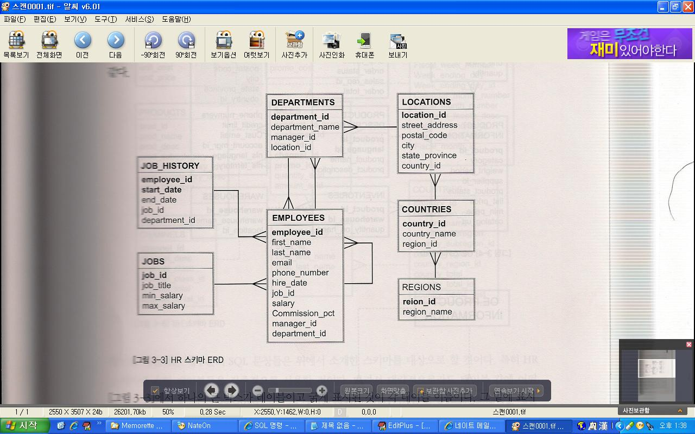
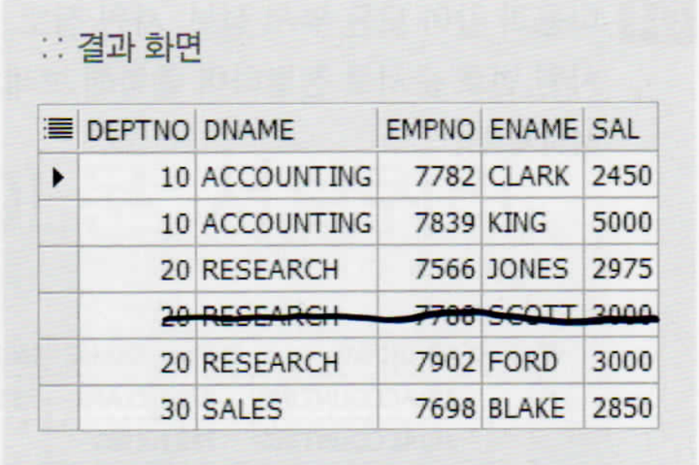
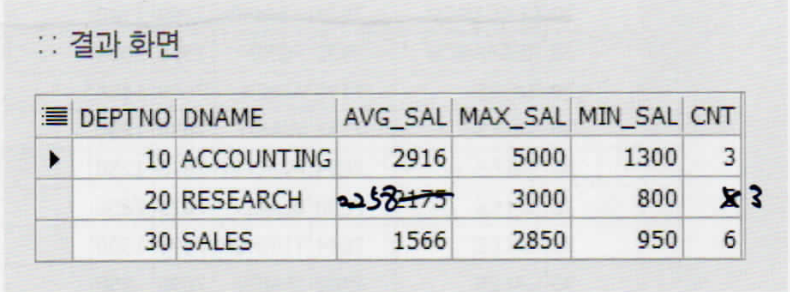
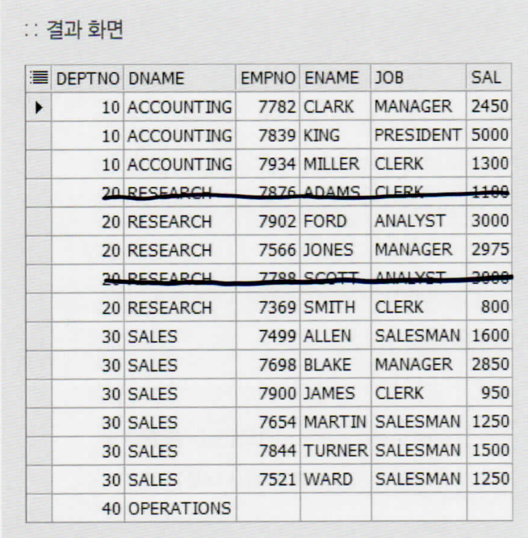
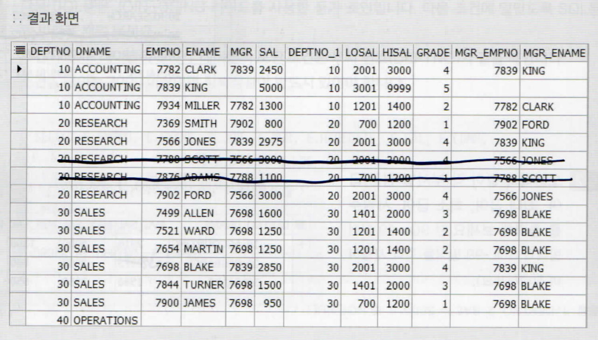

# SQL 계속


제약조건추가 연습

문제)

```
1. 회원 정보를 저장하는 테이블을 MEMBER란 이름으로 생성한다.


컬럼명        자료형             크기    유일키   NULL허용      키  비고
ID            VARCHAR2           20        Y         N          PK  회원ID
NAME          VARCHAR2           20        N         N              이름
REGNO         VARCHAR2           13        Y         N              주민번호
HP            VARCHAR2           13        Y         Y              핸드폰번호
ADDRESS       VARCHAR2           100       N         Y              주소


2.도서정보를 저장하는 테이블 BOOK이라는 이름을 생성한다.


컬럼명            자료형        크기    유일키    NULL허용    키  비고
CODE           NUMBER            4        Y         N          PK  제품코드
TITLE          VARCHAR2          50       N         N              도서명
COUNT          NUMBER            6        N         Y              수량
PRICE          NUMBER            10       N         Y              정가
PUBLISH        VARCHAR2          50       N         Y              출판사
  


3. 회원이 책을 주문하였을 때 이에 대한 정보를 저장하는 테이블
이름은 ORDER2로한다.


컬럼명       자료형     크기    유일키   NULL허용    키  비고
NO          VARCHAR2    10       Y         N         PK  주문번호
ID          VARCHAR2    20       N         N         FK  회원ID
CODE        NUMBER       4       N         N         FK  제품번호
COUNT       NUMBER       6       N         Y             주문건수
DR_DATE     DATE                 N         Y             주문일자
```


```
CREATE TABLE MEMBER(
ID VARCHAR2(20) PRIMARY KEY,
NAME VARCHAR2(20) NOT NULL,
REGNO VARCHAR2(13) UNIQUE,
HP VARCHAR2(13) UNIQUE,
ADDRESS VARCHAR2(100)
)

CREATE TABLE BOOK(
CODE NUMBER(4) PRIMARY KEY,
TITLE VARCHAR2(50) NOT NULL,
COUNT NUMBER(6),
PRICE NUMBER(10) NOT NULL,
PUBLISH VARCHAR2(50)
)

CREATE TABLE ORDER2(
NO VARCHAR2(10) PRIMARY KEY,
ID VARCHAR2(20) REFERENCES MEMBER(ID),
CODE NUMBER(4) REFERENCES BOOK(CODE),
COUNT NUMBER(6),
DR_DATE DATE
)
```


# JOIN

조인(JOIN)


실무에서는 두개이상의 테이블에서 데이터를 검색하기 위해서 


문제> 'King'의 부서이름을 출력하시오


```
SELECT employee_id, department_id FROM employees WHERE last_name = 'King';
```

킹의 번호를 알아내고 

```
SELECT department_id, department_name FROM department WHERE department_id IN(80,90);
```

진짜 원하는 정보를 출력


이렇게 두번을 해야하는데


JOIN이용방법

1. 내가 원하는 데이터가 무엇인가?(컬럼 목록)
2. 원하는 데이터가 어느 테이블에 있는가?
3. 여러테이블에 있다면 각각의 테이블의 공통컬럼을 찾는다.


```
SELECT e.employee_id, e.department_id, d.department_name
FROM employees e, departments d
WHERE e.department_id = d.department_id
AND last_name = 'King';
```


퀴즈) kosta223> '송강'교수가 강의하는 과목을 검색하라

```
SELECT p.pno, p.pname, c.cname 
FROM PROFESSOR p, COURSE c 
WHERE p.pno = c.pno AND pname = '송강';
```


예제) kosta223

- 학점이 2학점인 과목과 이를 강의하는 교수를 검색하라

```
SELECT pname, cname, st_num, p.pno 
FROM PROFESSOR p, COURSE c 
WHERE p.pno = c.pno AND st_num = 2;
```


- 화학과 1학년 학생의 기말고사 성적을 검색하라

```
SELECT st.sno, sname, syear, result 
FROM STUDENT st, SCORE sc
WHERE st.sno = sc.sno 
AND major = '화학' 
AND syear = 1;
```


- 화학과 1학년이 수각하는 과목을 검색하라(3개 테이블 조인)

```
SELECT major, st.sno, sc.cno, sname, syear, cname, result 
FROM STUDENT st, SCORE sc, COURSE c 
WHERE st.sno = sc.sno 
AND sc.cno = c.cno
AND syear = 1
AND major ='화학';
```


## ANSI JOIN

(이전)

```
SELECT e.employee_id, e.department_id, d.department_name
FROM employees e, departments d
WHERE e.department_id = d.department_id
AND last_name = 'King';
```

(이후)

```
SELECT e.employee_id, e.department_id, d.department_name
FROM employees e INNER JOIN departments d
ON e.department_id = d.department_id
WHERE last_name = 'King';
```

표기법이 다르니까 둘다 사용할 수 있도록 알아둬라


3개 이상 조인

-> 테이블 1 JOIN 테이블 2

ON 공통컬럼 1 = 공통컬럼1

JOIN 테이블 3

ON 공통컬럼2 = 공통컬럼2


퀴즈 hr> 3개 이상 테이블을 조인하여 사원이름, 이메일, 부서번호, 부서이름

직종번호(job_id), 직종이름(job_title)을 출력하라. (WHERE, ANSI)

```
SELECT last_name, email, e.department_id, d.department_name, e.job_id, job_title
FROM EMPLOYEES e INNER JOIN DEPARTMENTS d
ON e.DEPARTMENT_ID = d.DEPARTMENT_ID
INNER JOIN JOBS j
ON j.JOB_ID = e.JOB_ID;
```

JOIN이랑 INNER JOIN이랑 차이가 뭐지?

///참고

inner는 join의 디폴트 옵션으로 아래 sql문과 같이 생략 가능하다.

select emp.deptno, empno, ename, dname

from emp join dept

on emp.deptno = dept.deptno;

https://hanyugyeong.tistory.com/38?category=868014


퀴즈 hr> 'Seattle'(city)에 근무하는 사원이름, 부서번호, 직종번호, 직종이름, 도시이름을 출력하라.

```
SELECT e.EMPLOYEE_ID, e.DEPARTMENT_ID, e.JOB_ID, j.JOB_TITLE, l.CITY 
FROM EMPLOYEES e, DEPARTMENTS d, LOCATIONS l, JOBS j
WHERE e.DEPARTMENT_ID = d.DEPARTMENT_ID
AND d.LOCATION_ID = l.LOCATION_ID
AND e.JOB_ID = j.JOB_ID
AND l.CITY = 'Seattle';
```

```
SELECT e.EMPLOYEE_ID, e.DEPARTMENT_ID, e.JOB_ID, j.JOB_TITLE, l.CITY 
FROM EMPLOYEES e JOIN DEPARTMENTS d
ON e.DEPARTMENT_ID = d.DEPARTMENT_ID
JOIN LOCATIONS l
ON l.LOCATION_ID = d.LOCATION_ID
JOIN JOBS j
ON j.JOB_ID = e.JOB_ID
WHERE l.CITY = 'Seattle';
```


결국은 E-R 다이어그램이 제일 중요하다.

E-R 다이어그램



JOIN을 할때 E-R다이어그램을 보고하기 때문에 E-R다이어그램이 제일 중요하다.


### SELF 조인

=> 'kochhar' 직속상사 정보를 출력하라

```
SELECT A.last_name ||'의 메니저는 ' ||B.last_name||'이다.'
FROM employees A, employees B
WHERE A.manager_id = B.employee_id
AND A.last_name = 'Kochhar';
```


퀴즈 kosta223> 학생 중에 동명이인을 검색하라.

```
SELECT DISTINCT  B.sname FROM STUDENT A, STUDENT B
WHERE A.SNAME = B.SNAME
AND a.sno != b.sno;
```


### OUTER JOIN(외부조인) INNER JOIN(내부조인) 의 차이점에 대해서도 면접에서 많이 나온다. 

SELCET * FROM employees; => 107row가 나온다.


두 테이블을 내부조인했다.

```
SELECT e.employee_id, e.department_id, d.department_name
FROM employees e, departments d
WHERE e.department_id = d.department_id
```


실행결과 106개 row가 나온다.


그 이유는 department_id가 null인 사람이있다. 79번사람

null인 녀석은 일치하는 녀셕이 없기떄문에 누락된다.


하지만 실제로는 일치하지 않은 값을 가졌더라도 출력이 되어줘야하는 경우가 있다.

이떄 사용하는게 OUTER JOIN이다.

## OUTER JOIN

```
SELECT e.employee_id, e.department_id, d.department_name
FROM employees e, departments d
WHERE e.department_id = d.department_id(+)
```

누락된 정보가 있는 테이블의 반대테이블에 (+)를 해준다. 


-> ANSI JOIN을 하는 경우

```
SELECT e.employee_id, e.department_id, d.department_name
FROM employees e LEFT JOIN departments d
ON e.department_id = d.department_id;
```

#### 누락된 테이블이 왼쪾에 있으니까 LEFT를 넣어준다. 

#### 만약 누락된 테이블이 오른쪽에 있으면 RIGHT을 써준다. 

위 내용을 자주 까먹는 내용이니 잘 알아두자. 


퀴즈> kosta> 등록된 과목에 대한 모든 교수를 검색하라.(등록하지 않은 교수도 출력)

```
SELECT p.PNO, p.PNAME, c.CNAME FROM PROFESSOR p , COURSE c WHERE p.pno = c.pno(+);
```

```
SELECT p.PNO, p.PNAME, c.CNAME FROM PROFESSOR p LEFT JOIN COURSE c ON p.pno = c.pno;
```


### 예제) hr>

- 이름이 ‘Himuro’인 사원의 부서명을 출력하라.

```
SELECT e.last_name, d.DEPARTMENT_NAME FROM employees e, DEPARTMENTS d
WHERE e.DEPARTMENT_ID = d.DEPARTMENT_ID
AND e.LAST_NAME = 'Himuro';
```

```
SELECT e.last_name, d.DEPARTMENT_NAME 
FROM employees e JOIN DEPARTMENTS d
ON e.DEPARTMENT_ID = d.DEPARTMENT_ID
AND e.LAST_NAME = 'Himuro';
```


- 직종명이 'Accountant'인 사원의 이름과 부서명을 출력하라.

```
SELECT e.last_name, j.JOB_TITLE ,d.DEPARTMENT_NAME FROM employees e, DEPARTMENTS d, JOBS j
WHERE e.DEPARTMENT_ID = d.DEPARTMENT_ID
AND e.JOB_ID = j.JOB_ID
AND j.JOB_TITLE = 'Accountant';
```

```
SELECT e.last_name, j.JOB_TITLE ,d.DEPARTMENT_NAME 
FROM employees e JOIN DEPARTMENTS d
ON e.DEPARTMENT_ID = d.DEPARTMENT_ID
JOIN  JOBS j
ON e.JOB_ID = j.JOB_ID
AND j.JOB_TITLE = 'Accountant';
```


- 커미션을 받는 사람의 이름과 그가 속한 부서를 출력하라.

```
SELECT e.last_name ,d.DEPARTMENT_NAME, e.COMMISSION_PCT FROM employees e, DEPARTMENTS d
WHERE e.DEPARTMENT_ID = d.DEPARTMENT_ID
AND e.COMMISSION_PCT is not null;
```

```
SELECT e.last_name ,d.DEPARTMENT_NAME, e.COMMISSION_PCT 
FROM employees e JOIN DEPARTMENTS d
ON e.DEPARTMENT_ID = d.DEPARTMENT_ID
AND e.COMMISSION_PCT is not null;
```


- 급여가 4000이하인 사원의 이름, 급여, 근무지를 출력하라.

```
SELECT e.last_name ,d.DEPARTMENT_NAME, l.CITY, e.SALARY FROM employees e, DEPARTMENTS d, LOCATIONS l
WHERE e.DEPARTMENT_ID = d.DEPARTMENT_ID
AND d.LOCATION_ID = l.LOCATION_ID
AND e.SALARY<=4000;
```

```
SELECT e.last_name ,d.DEPARTMENT_NAME, l.CITY, e.SALARY 
FROM employees e JOIN DEPARTMENTS d
ON e.DEPARTMENT_ID = d.DEPARTMENT_ID
JOIN LOCATIONS l
ON d.LOCATION_ID = l.LOCATION_ID
AND e.SALARY<=4000;
```


- 'Chen'과 동일한 부서에서 근무하는 사원의 이름을 출력하라.

```
SELECT e.last_name, e2.last_name ,e2.DEPARTMENT_ID 
FROM employees e, EMPLOYEES e2
WHERE e.DEPARTMENT_ID = e2.DEPARTMENT_ID
AND e.last_name = 'Chen'
AND e2.LAST_NAME != 'Chen';
```

```
SELECT e.last_name, e2.last_name ,e2.DEPARTMENT_ID 
FROM employees e JOIN EMPLOYEES e2
ON e.DEPARTMENT_ID = e2.DEPARTMENT_ID
AND e.last_name = 'Chen'
AND e2.LAST_NAME != 'Chen';
```


### 퀴즈) scott>

- 

```
SELECT e.DEPTNO, DNAME, EMPNO, ENAME, SAL FROM EMP e, DEPT d
WHERE e.DEPTNO = d.DEPTNO
AND sal > 2000;
```

```
SELECT e.DEPTNO, DNAME, EMPNO, ENAME, SAL 
FROM EMP e JOIN DEPT d
ON e.DEPTNO = d.DEPTNO
AND sal > 2000;
```



- 

```
SELECT d.DEPTNO, DNAME, 
TRUNC(SUM(sal)/COUNT(*),0) AS AVG_SAL, 
MAX(sal) AS MAX_SAL, 
MIN(sal) AS MIN_SAL, 
COUNT(*) AS CNT 
FROM EMP e, DEPT d
WHERE e.DEPTNO = d.DEPTNO
GROUP BY d.DEPTNO, d.DNAME;
```

```
SELECT d.DEPTNO, DNAME, 
TRUNC(SUM(sal)/COUNT(*),0) AS AVG_SAL, 
MAX(sal) AS MAX_SAL, 
MIN(sal) AS MIN_SAL, 
COUNT(*) AS CNT 
FROM EMP e JOIN DEPT d
ON e.DEPTNO = d.DEPTNO
GROUP BY d.DEPTNO, d.DNAME;
```



- 

```
SELECT d.DEPTNO, DNAME, EMPNO, ENAME, JOB, SAL
FROM EMP e, DEPT d
WHERE e.DEPTNO(+) = d.DEPTNO
ORDER BY e.DEPTNO,e.ENAME;
```

```
SELECT d.DEPTNO, DNAME, EMPNO, ENAME, JOB, SAL
FROM EMP e RIGHT JOIN DEPT d
ON e.DEPTNO = d.DEPTNO
ORDER BY e.DEPTNO,e.ENAME;
```



- 

```
SELECT d.DEPTNO, d.DNAME, e.EMPNO, e.ENAME, e.MGR, e.SAL, e2.DEPTNO AS DEPTNO_1, LOSAL, HISAL, GRADE, e2.EMPNO AS MGR_EMPNO, e2.ENAME AS MGR_ENAME
FROM EMP e, EMP e2, DEPT d, SALGRADE s
WHERE e.DEPTNO(+) = d.DEPTNO
AND e.MGR = e2.EMPNO(+)
AND e.SAL BETWEEN s.LOSAL(+) AND s.HISAL(+)
ORDER BY d.DEPTNO, e.EMPNO;
```

```
SELECT d.DEPTNO, d.DNAME, e.EMPNO, e.ENAME, e.MGR, e.SAL, e2.DEPTNO AS DEPTNO_1, LOSAL, HISAL, GRADE, e2.EMPNO AS MGR_EMPNO, e2.ENAME AS MGR_ENAME
FROM EMP e RIGHT JOIN DEPT d 
ON e.DEPTNO = d.DEPTNO
LEFT JOIN EMP e2
ON e.MGR = e2.EMPNO
LEFT JOIN SALGRADE s
ON e.SAL BETWEEN s.LOSAL AND s.HISAL
ORDER BY d.DEPTNO, e.EMPNO;
```



