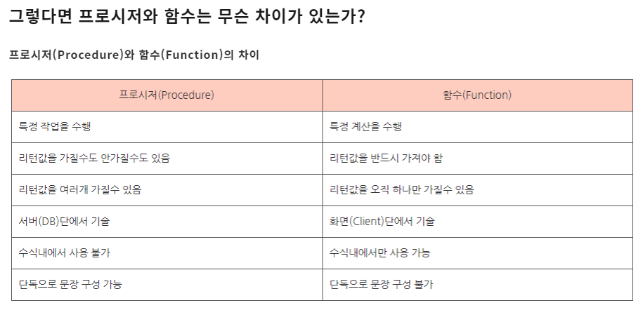

```
set serveroutput on;
```

```
** 6일 수업내용

퀴즈hr>기존 jobs => jobs2 복사
            프로시저를 이용하여 job_id, job_title, min_salary, max_salary
            입력받아 테이블에 새로운 row를 추가해 보자.

 CREATE TABLE jobs2 AS SELECT * FROM jobs;

 CREATE OR REPLACE PROCEDURE my_new_job_proc(
	p_job_id IN jobs2.job_id%TYPE,
	p_job_title IN jobs2.job_title%TYPE,
	p_min_salary IN jobs2.min_salary%TYPE,
	p_max_salary IN jobs2.max_salary%TYPE)
 IS

 BEGIN
         INSERT INTO jobs2(job_id, job_title, min_salary, max_salary)
	VALUES(p_job_id, p_job_title, p_min_salary, p_max_salary);

         COMMIT;
END;

EXECUTE my_new_job_proc('a', 'a1', 1000, 5000);


<과제 hr>jobs2테이블 job_id 제약조건(pk) 추가
      프로시저를 이용하여 동일한 job_id를 체크
      NO => Insert 실행
      Yes => Update 실행

ALTER TABLE jobs2
	ADD CONSTRAINT job2_job_id_pk PRIMARY KEY(job_id)

CREATE OR REPLACE PROCEDURE my_new_job_proc2(
	p_job_id IN jobs2.job_id%TYPE,
	p_job_title IN jobs2.job_title%TYPE,
	p_min_salary IN jobs2.min_salary%TYPE,
	p_max_salary IN jobs2.max_salary%TYPE)
 IS
        v_cnt NUMBER := 0;

 BEGIN
        --동일한 job_id 체크
       SELECT COUNT(*) INTO v_cnt
	FROM jobs2
	WHERE job_id = p_job_id;

       IF v_cnt = 0 THEN
	INSERT INTO jobs2(job_id, job_title, min_salary, max_salary)
		VALUES(p_job_id, p_job_title, p_min_salary, p_max_salary);
       ELSE
	UPDATE jobs2
		SET job_title = p_job_title,
		min_salary = p_min_salary,
		max_salary = p_max_salary
	WHERE job_id = p_job_id;
       END IF;

         COMMIT;
END;


EXECUTE my_new_job_proc2('a', 'a222', 10, 400000);

--매개변수 디폴트 값 설정

CREATE OR REPLACE PROCEDURE my_new_job_proc3(
	p_job_id IN jobs2.job_id%TYPE,
	p_job_title IN jobs2.job_title%TYPE,
	p_min_salary IN jobs2.min_salary%TYPE := 100,
	p_max_salary IN jobs2.max_salary%TYPE := 10000)
 IS
        v_cnt NUMBER := 0;

 BEGIN
        --동일한 job_id 체크
       SELECT COUNT(*) INTO v_cnt
	FROM jobs2
	WHERE job_id = p_job_id;

       IF v_cnt = 0 THEN
	INSERT INTO jobs2(job_id, job_title, min_salary, max_salary)
		VALUES(p_job_id, p_job_title, p_min_salary, p_max_salary);
       ELSE
	UPDATE jobs2
		SET job_title = p_job_title,
		min_salary = p_min_salary,
		max_salary = p_max_salary
	WHERE job_id = p_job_id;
       END IF;

         COMMIT;
END;

EXECUTE my_new_job_proc3('b', 'b222');


--OUT, IN 매개변수


create or replace PROCEDURE my_new_job_proc4(
	p_job_id IN jobs2.job_id%TYPE,
	p_job_title IN jobs2.job_title%TYPE,
	p_min_salary IN jobs2.min_salary%TYPE := 100,
	p_max_salary IN jobs2.max_salary%TYPE := 10000,
	p_result OUT NUMBER)
 IS
        v_cnt NUMBER := 0;

 BEGIN
        --동일한 job_id 체크
       SELECT COUNT(*) INTO v_cnt
	FROM jobs2
	WHERE job_id = p_job_id;

       IF v_cnt = 0 THEN
	p_result := 1;
	INSERT INTO jobs2(job_id, job_title, min_salary, max_salary)
		VALUES(p_job_id, p_job_title, p_min_salary, p_max_salary);
       ELSE
	p_result := 2;
	UPDATE jobs2
		SET job_title = p_job_title,
		min_salary = p_min_salary,
		max_salary = p_max_salary
	WHERE job_id = p_job_id;
       END IF;

         COMMIT;
END;

-- 프로시저 실행

DECLARE
   p_result NUMBER;
BEGIN
   my_new_job_proc4('c', 'c11', 1000, 10000, p_result);
   IF p_result = 1 THEN
     dbms_output.put_line('추가 되었습니다.');
   ELSE
     dbms_output.put_line('수정 되었습니다.');
   END IF;   
END;

* 함수(Function)
  - 프로시저에 비해 실행 결과를 더 유연하게 사용 가능 -> 기존 sql문 사용가능

 CREATE OR REPLACE FUNCTION getSalary(
			p_no employees.employee_id%TYPE)
	RETURN NUMBER
 IS
	v_salary NUMBER;
BEGIN
	SELECT salary INTO v_salary
		FROM employees
		WHERE employee_id = p_no;

	RETURN v_salary;
END;

SELECT getSalary(100) FROM dual;

퀴즈hr>사원번호를 입력 받아 이름을 반환하는 함수를 구현하자.
            없으면 => 해당 사원 없음

CREATE OR REPLACE FUNCTION get_emp_name (
	p_employee_id employees.employee_id%TYPE)
     RETURN VARCHAR2
  IS   
    result VARCHAR2(50) := null;
  BEGIN
    -- 사원명을 가져온다. 
    SELECT last_name
      INTO result
      FROM employees
     WHERE employee_id = p_employee_id;
     
        -- 사원명 반환	
    RETURN result;

  EXCEPTION
    WHEN NO_DATA_FOUND THEN
  	return '해당사원없음';
  END;

SELECT get_emp_name(100) FROM dual;

```


## 패키지(Package)

```
  - 관련있는 프로시저/함수를 효율적으로 관리하기 위해 모듈화시켜 배포

 --패키지 선언
 CREATE OR REPLACE PACKAGE my_package
 IS
   PROCEDURE getEmployee(in_id IN employees.employee_id%TYPE,
		out_id OUT employees.employee_id%TYPE,
		out_name OUT employees.first_name%TYPE,
		out_salary OUT employees.salary%TYPE);

   FUNCTION getSalary(p_no employees.employee_id%TYPE)
	RETURN NUMBER;

 END;


 --패키지 본문정의

CREATE OR REPLACE PACKAGE BODY my_package
IS
  --프로시저 내용
  PROCEDURE getEmployee(in_id IN employees.employee_id%TYPE,
		out_id OUT employees.employee_id%TYPE,
		out_name OUT employees.first_name%TYPE,
		out_salary OUT employees.salary%TYPE)
  IS
  BEGIN
	SELECT employee_id, first_name, salary
		INTO out_id, out_name, out_salary
		FROM employees
		WHERE employee_id = in_id;
  END;--프로시저end

  --함수 내용
  FUNCTION getSalary(p_no employees.employee_id%TYPE)
	RETURN NUMBER
  IS
	v_salary NUMBER;
  BEGIN
	SELECT salary INTO v_salary
		FROM employees
		WHERE employee_id = p_no;

	RETURN v_salary;

   END;--함수 end

END;--패키지 end

--함수 실행
 SELECT my_package.getSalary(100) FROM dual;

--프로시저 실행
DECLARE
	p_id NUMBER;
	p_name VARCHAR2(50);
	p_salary NUMBER;

BEGIN
	my_package.getEmployee(100, p_id, p_name, p_salary);
	dbms_output.put_line(p_id||'  '||p_name||'   '||p_salary);

END;
```



출처:https://mjn5027.tistory.com/47


```
<mission hr> employees2에서 retire_date 컬럼을 추가하자.
  ALTER TABLE employees2 ADD(retire_date date);
  그리고 아래의 내용에 맞는 package,  procedure 만들어 보자.

--패키지 선언부
CREATE OR REPLACE PACKAGE hr_pkg IS
    --신규 사원 입력
    PROCEDURE new_emp_proc(ps_emp_name IN VARCHAR2,
	pe_email IN VARCHAR2,
	pj_job_id IN VARCHAR2,
	pd_hire_date IN VARCHAR2);
    -- TO_DATE(pdhire_date, 'YYYY-MM-DD');

   -- 퇴사 사원 처리
   PROCEDURE retire_emp_proc(pn_employee_id IN NUMBER);

END hr_pkg;


--패키지 본문

CREATE OR REPLACE PACKAGE BODY hr_pkg IS
 -- 신규 사원 입력
  PROCEDURE new_emp_proc(ps_emp_name IN VARCHAR2,
	pe_email IN VARCHAR2,
	pj_job_id IN VARCHAR2,
	pd_hire_date IN VARCHAR2)
  IS
    vn_emp_id employees2.employee_id%TYPE; 
    vd_hire_date DATE := TO_DATE(pd_hire_date, 'YYYY-MM-DD');

  BEGIN
        --신규사원 사번 => 마지막(최대)사번 + 1
        SELECT  NVL(MAX(employee_id), 0) + 1
	INTO vn_emp_id
	FROM employees2;

      --신규사원 등록
       INSERT INTO employees2(employee_id, last_name, hire_date, email, job_id)
	VALUES(vn_emp_id, ps_emp_name, vd_hire_date, pe_email, pj_job_id);

       COMMIT;

       EXCEPTION WHEN OTHERS THEN
	dbms_output.put_line('insert error');
	ROLLBACK;

  END new_emp_proc;

  --퇴사처리
  --퇴사한 사원은 사원테이블에서 삭제하지 않고 퇴사일자(retire_date)를 NULL에서 갱신
  PROCEDURE retire_emp_proc(pn_employee_id IN NUMBER)
  IS
    vn_cnt NUMBER := 0;
    e_no_data EXCEPTION;
  BEGIN
      UPDATE employees2
	SET retire_date = SYSDATE
	WHERE employee_id = pn_employee_id
	AND retire_date IS NULL;

      --UPDATE된 건수를 가져오기
      vn_cnt := SQL%ROWCOUNT;

     --갱신된 건수가 0이면 사용자 예외처리
     IF vn_cnt = 0 THEN
        RAISE e_no_data; --인위적으로 사용자 예외 발생
     END IF;

     COMMIT;

     EXCEPTION WHEN e_no_data THEN
	dbms_output.put_line(pn_employee_id ||'는 퇴사대상이 아닙니다.');
	ROLLBACK;

   END retire_emp_proc;

END hr_pkg;


EXECUTE hr_pkg.new_emp_proc('홍길동', 'aaa@aa.com', 'AD_VP', '2021-02-24');

EXECUTE hr_pkg.retire_emp_proc(100);
```


## 트리거(Trigger)

- 트리거란 특정 테이블의 데이터에 변경이 이루어 졌을때 자동으로 
  다른 어떤 작업이 함께 수행되도록 설정하는 것

```
  CREATE TABLE emp11(
    empno NUMBER PRIMARY KEY,
    ename VARCHAR2(20),
    job VARCHAR2(20)
  )

  CREATE OR REPLACE TRIGGER trg_01
          AFTER INSERT
          ON emp11
          BEGIN
	dbms_output.put_line('신입사원이 추가되었습니다.');
  END;
	

INSERT INTO emp11 VALUES(1, '홍길동', '개발');

 --트리거 유형
  문장 레벨 트리거 - DML문을 실행할 때 한번만 트리거 실행
  행 레벨 트리거(FOR EACH ROW) - DML문 여러번 실행 => 트리거 여러번 수행

 CREATE TABLE sal01(
   salno NUMBER PRIMARY KEY,
   sal NUMBER,
   empno NUMBER REFERENCES emp11(empno)
 )
 
 CREATE SEQUENCE sal01_salno_seq;

 CREATE OR REPLACE TRIGGER trg02
     AFTER INSERT
     ON emp11
     FOR EACH ROW
     BEGIN
	INSERT INTO sal01 VALUES(sal01_salno_seq.NEXTVAL, 3000, :NEW.empno);
END;


 - INSERT -> :OLD -> NULL, :NEW -> 입력값
 - UPDATE -> :OLD -> 변경전 값, :NEW -> 변경후 값
 - DELETE -> :OLD -> 삭제전 값, :NEW -> NULL 
		

INSERT INTO emp11 VALUES(2, '박길동', '영업');


키즈hr>사원이 삭제되면 그 사원의 급여정보(sal01)테이블에서 해당 로우도 함께
           삭제 되도록 트리거를 구현해 보자.

 CREATE OR REPLACE TRIGGER trg_03
	AFTER DELETE
	ON emp11
	FOR EACH ROW
	BEGIN
		DELETE FROM sal01 WHERE empno = :OLD.empno;
		dbms_output.put_line('sal01테이블에서도 삭제되었습니다.');
 END;


DELETE FROM emp11 WHERE empno = 2;


* 트리거 삭제
 DROP TRIGGER 트리거명

1. 엔티티추출 과정 단계별 정의
2. 관계정의 : 내용, 커디넬리티, 
4. 식별자 : 주식별자, 비식별자
```