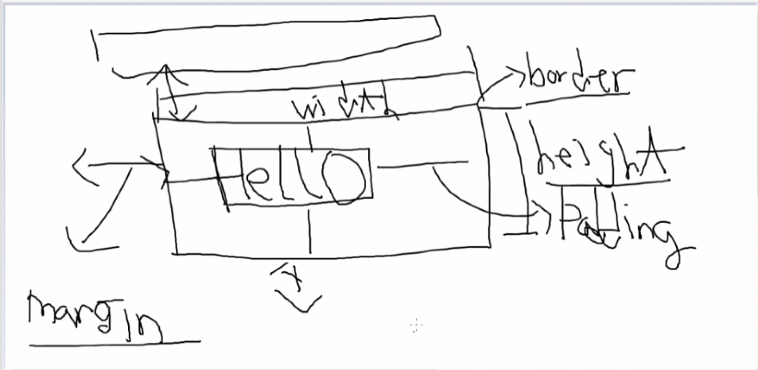

# HTML 기본


### block 요소 태크 : div, h1~h6, p, ul, li

- 해당 태그가 전체 한줄을 차지하는것


### inline요소 태그 : a, sapn, img

- 해당 태그 컨텐츠 크기만큼 점유


=> block요소 안에 block, inline요소가 포함 가능

=> inline요소 안에 inline요소 포함 가능


### 그룹태그 (div, span) : 어떤 의미와 기능이 없다. 

그냥 그룹화하기 위함


- ul : 목록을 나타내는 태그

- li : 목록 리스트


- ol: 목록에 순수가 있는태그


```
css

display: inline; 한줄로 표시
```


```
css
a{
text-decoration: none;
font-size: 20px;
font-weight:bold;
}
```

이런식으로 스타일을 지정해줄수있다.


- dl: 키벨류로 목록을 나타냄
  - dt: 타이틀
  - dd:내용


### 멀티미디어에 이용하는 태그

```
<figure> 태그를쓰는걸 권장
```
```
<figure>
    <ficaption>동영상</figcaption>
        <video width="640" height="360" controls="controls">
            <source src="Merry_Love.MP4" type="video/mp4">
        </video>
</figure>
```


### 표를 만드는 테그

```
<table width="450" border="1" cellspadding="0" cellspacing="0">
	<caption>2021 프로야구 순위</caption>
	<thead>
		<tr height ="50" align="center">
			<th>순위</th>
			<th>팀명</th>
			<th>승</th>
		</tr>
	</thead>
	<tbody>
		<tr height="50" align="center">
			<td>1</td>
			<td>KT</td>
			<td>90</td>
		</tr>
		<tr height="50" align="center">
			<td>1</td>
			<td>KT</td>
			<td>90</td>
		</tr>
		<tr height="50" align="center">
			<td>1</td>
			<td>KT</td>
			<td>90</td>
		</tr>
	</tbody>
</table>
```

그런데 이런거 쓰지말고 CSS를 쓰도록 하자.

이건 구시대 유물


- colspan
- rowspan

이 두개를 통해서 테이블의 셀을 병합할 수 있다.

****

### Iframe

Iframe을 사용해서 다른 문서를 포함할 수 있다.

```
<iframe src="table_exam.html" width="800" height="500" title="테이블예제"></iframe>
```

****


### form

- input

- select
- 


for 속성 예시

```
<label for="name">이름</label>
<input type="text" name="userName" id="name">
```

이렇게 label에 for 속성을 넣어주면 이름을 눌러도 input에 커서가 들어간다.

input의 속성중 하나로 

- `autofocus`를 넣어주면 프로그램실행시 커서가 자동으로 들어간다.

이러한 디테일이 중요하다.

- `placeholder` 입력창에 예시가 보인다.

- `required="required"` 반드시 입력해야한다고 지정해준다.


input 태그의 type속성으로 다양한걸 지원해준다. 

- `email` 이메일값 입력
- `date` 날짜
- `text` 그냥 텍스트

- `range` 숫자 범위를 바로 표현

  ``` 
  <input type="range" min="1" max="10" value="5">//이런느낌
  ```


선택하기 위한 이런것도 있다.

```
<select multiple="multiple">
<option value="볼보">볼보</option>
<option value="벤츠">벤츠</option>
<option value="비엠">비엠</option>
</select>
```


# CSS

css는 이거로 끝남




그리고 

## position

부모가 position: relative이면

자식이 position: absolute하면 부모의 포지션을 기준으로 움직여진다. 


