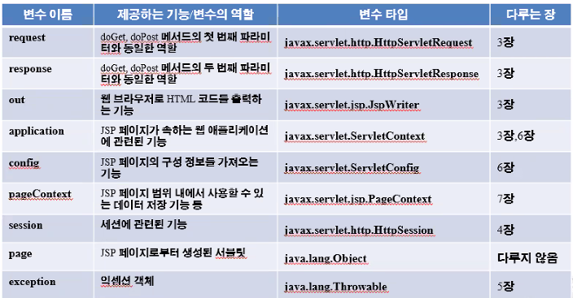

# request.getParametter();

파라미터 받아오기


# JSP

- 마크업 기반으로 되어있다.(화면처리 ㅣ용이)
- servlet과 동일한 기능을 할 수 있다.
  - 클라이언트로부터 요청을 받아 처리해서 응답하는 것

`<% %>`: 스크립트릿: 비지니스 로직(Java)

`<%@page` : 지시자: 문서에 대한 사전 정보를 설정

`<%= %>`:표현식 : 화면에 데이터를 출력


****


- JSP: 비지니스가 늘어나면 자바코드 증가
  - 비지니스 영역과 프리젠테이션 영역 구분이 어려움
  - 스크립트릿 영역을 최소화
  - 액션태그, EL태그, MVC 이런것들을 사용할수록 비지니스 영역과 스크립트 영역을 구분할 수 있다.

### 지시자

<%@page -> 지시자 : 문서에 대한 사전 정보를 설정

<%@include  -:> include지시자: 페이지를 포함

<%@taglib -> taglib 지시자: 커스텀 태그를 사전에 설정하기 위해

<%-- --%> jsp 주석

### 액션테그

<jsp:include

<jsp:forword

<c:foreach


### 내장 객체

```
	<%
		request.setCharacterEncoding("utf-8");
		String s1 = request.getParameter("num1");
	%>
```

이런게 내장 객체이다.

- JSP에서 객체를 생성하지 않고도 사용할 수 있는 객체 9가지가 있다.

- 이런거는 바로 가져다가 쓰면 된다

  


### Dispatcher, Redirect 차이점

https://dololak.tistory.com/502

- Dispatcher: 페이지 forward 
- A page -> B page(Dispatcher) -> C page (B page 연장선)

redirect로 데이터 전달하는 법

redirect하는 url에 파라미터로 전달해줘야한다.


## <jsp:forward page=


## 액션태그

\<jsp:forward> =>> Dispatcher방식을 이동 : 페이지 요청의 연장


