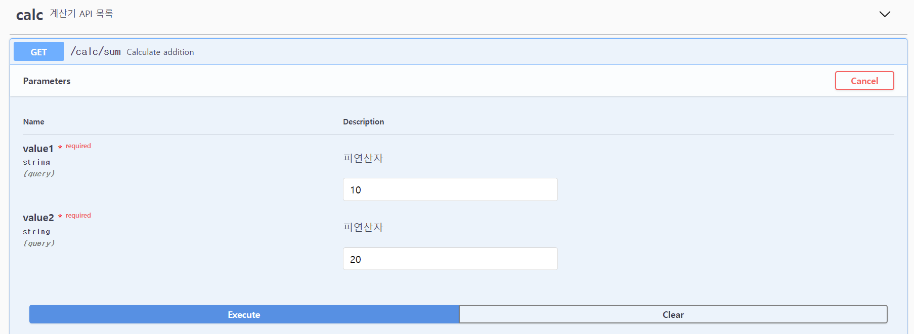

# swagger를 쓰는 이유

https://nurilab.github.io/2020/04/19/we_do_swagger/


결국 API명세를 위해서 쓰는것

flask의 swagger 확장팩 flask_restplus를 이용해서 api구성

```
# Rest Api로 구현한 계산기 예제

import werkzeug
werkzeug.cached_property = werkzeug.utils.cached_property

from flask import Flask
from flask_restplus import Resource, Api, reqparse

#-----------
# API
# ---------------

app = Flask(__name__)
api = Api(app, version='1.0', title = 'Calc API', description='계산기 REST API 문서',)

ns = api.namespace('calc', description='계산기 API 목록')
app.config.SWAGGER_UI_DOC_EXPANSION = 'list' #None, list, full

## 덧셈을 위한 API 정의
sum_parser = ns.parser()
sum_parser.add_argument('value1', required=True, help='피연산자')
sum_parser.add_argument('value2', required=True, help='피연산자')

@ns.route('/sum')
@ns.expect(sum_parser)
class FileReport(Resource):
    def get(self):
        """
            Calculate addition
        """
        args = sum_parser.parse_args()

        try:
            val1 = args['value1']
            val2 = args['value2']
        except KeyError:
            return {'result':'ERROR_PARAMETER'}, 500

        result = {'result':'ERROR_SUCCESS', 'value':int(val1)+int(val2)}
        return result, 200
        
if __name__ == '__main__':
    app.run(host='0.0.0.0', port=5000)

```




이렇게 파라미터를 입력하고 결과값을 바로확인해볼 수 있다.

너무 좋다... 이름값한다. 스웩넘치네 ㅋㅋ

****


## 스웨거 스프링부트


